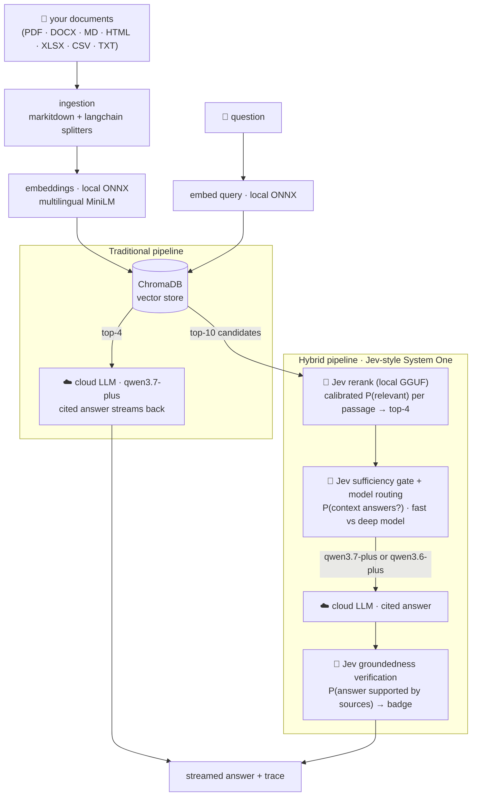

<div align="center">
  
</div>

# Jev-RAG — local-first hybrid RAG, with receipts

[](https://github.com/kanishka-namdeo/jev-rag/actions/workflows/ci.yml)
[](LICENSE)
[](backend/)
[](src/)
[](#what-runs-where)

**One app, two retrieval-augmented pipelines over your own documents — and a built-in benchmark
lab that measures, with an independent LLM judge, exactly what the hybrid adds.**

| | **Traditional RAG** | **Hybrid RAG (Jev-style)** |
| --- | --- | --- |
| Retrieval | embedding similarity (top-4 straight to the LLM) | broad top-10 + **local Jev-style rerank** with calibrated P(relevant) per passage |
| Quality gate | — | **Jev sufficiency gate**: P(context actually answers the question) |
| Model choice | fixed (`qwen3.7-plus`) | **Jev routing** picks `qwen3.7-plus` (fast synthesis) vs `qwen3.6-plus` (deep reasoning) per query |
| Verification | — | **Jev groundedness check** on the final answer, shown as a live badge |
| Trace | retrieval + LLM stats | every decision with probabilities, latencies, tokens, estimated cost |
| When you want | speed (≈1.5 s) | accuracy + abstention discipline (≈30 s on 2 CPU cores) |

Everything except the cloud LLM endpoint runs **locally**: embeddings (ONNX CPU), vector store
(ChromaDB embedded), the Jev-style decision model (0.53 GB GGUF on llama.cpp), and storage
(SQLite). Answers stream with inline `[1]`-style citations linked to your sources.

> **What is "Jev"?** [Jev](https://typesafe.ai/blog/introducing-system-one-models-and-jev) is
> TypeSafe AI's closed-weights "System One" decision model — it makes typed, calibrated
> decisions (it never generates text). This project uses its open-source, locally-runnable
> equivalent: [Jev-Style-0.8B-Decision-v3](https://huggingface.co/chaoliangUNSW/Jev-Style-0.8B-Decision-v3-GGUF)
> (Apache-2.0) via the [jev-style](https://github.com/lawrence3699/jev-style) package, with a
> custom llama.cpp scorer. The cloud "System Two" is an OpenAI-compatible Dashscope endpoint.
> The full rationale — including the decision-prompt patterns that were measured to work — is in
> [docs/hybrid-design.md](docs/hybrid-design.md).

---

## What was achieved

> **Current state (2026-09-28) — three evidence updates, one headline each.**
> (1) The v2 pipeline initially **lost** to traditional on the internal suite (62.5% vs 83.3%);
> the regression was attributed to the passage battery's miscalibrated absolute thresholds,
> which now ship OFF by default. (2) With the battery off, v2 **recovered v1-level numbers**:
> hybrid 92.7% vs traditional 87.5% within-run (+5.2pp, n.s.), over-abstention back to 4.7%,
> zero fabrications ([docs/benchmark-results.md](docs/benchmark-results.md)). (3) Across
> **five popular public benchmarks** (SQuAD, HotpotQA, TriviaQA, 2WikiMultiHopQA, MuSiQue —
> 98 seeded questions, same audited protocol) the hybrid wins **every multi-hop benchmark**
> (+12 to +25pp; pooled multi-hop +18.4pp) and is neutral-to-negative on single-hop with
> saturated retrieval (TriviaQA 0pp, SQuAD −12pp); pooled +7.6pp — a scattered-evidence
> specialist whose sufficiency gate needs per-corpus re-calibration for single-hop corpora
> ([docs/benchmark-public.md](docs/benchmark-public.md),
> [docs/benchmark-public-wave2.md](docs/benchmark-public-wave2.md)).

The two systems were benchmarked head-to-head on **6 document scenarios × 48 ground-truth
questions**, both arms under a matched context budget (top-4), scored by an **independent LLM
judge** (`kimi-k2.5` — a different model family than either generator, JSON-only, temperature 0,
position-swapped pairwise verdicts, 8/8 canary self-test).

| Headline metric (48 Q, pooled) | Traditional | Hybrid (Jev) | Δ |
| --- | --- | --- | --- |
| **Correctness (judge)** | 85.4% | **93.8%** | **+8.4pp** |
| Faithfulness (judge) | 99.0% | 99.0% | = |
| Earnings-distractor scenario | 75% | **100%** | **+25pp** |
| Over-abstention on answerable Q | 14% | **2.3%** | −11.7pp |
| Proper abstention on unanswerable Q | 100% | 100% | = |
| Fabrication rate (unanswerable Q) | 0% | 0% | = |
| Jev sufficiency-gate accuracy | — | 91.7% (Brier 0.077) | — |
| Pairwise win rate (judge, both orders) | — | 54.2% (6W/40T/2L) | — |
| Latency p50 | 1.5 s | 30.5 s | +29 s ⚠️ |
| Cloud cost per query | $0.0004 | $0.0004 | = |

**Reading of the results** (full detail in [docs/benchmark-results.md](docs/benchmark-results.md)):

- The hybrid's biggest wins are exactly where a naive RAG fails: **near-identical distractor
  documents** (two earnings reports with matching numbers — 75% → 100%) and **not answering when
  it shouldn't** (over-abstention 14% → 2.3%, zero fabrications).
- Retrieval metrics (hit@4, MRR) were already near-perfect for both arms on these small corpora,
  so the quality gains come from the hybrid's full-system orchestration — gate + route + verify —
  not from raw ranking. The honest tradeoff is **latency**: three local Jev decision calls add
  ~29 s on 2 CPU cores. Tuning knobs are documented.
- **Statistical honesty**: retroactive paired tests on the v1 run give McNemar p = 0.125 and
  Wilcoxon p = 0.046 (bootstrap CI +0.02…+0.17) — a positive trend, underpowered at n=48, not an
  established win. The v2 regression, by contrast, is significant on two of three tests. We
  report both directions with the same yardstick.
- Everything is reproducible from the UI: open the **Benchmarks** tab, pick scenarios, run.
  A full run is ~40–100 min on 2 cores for a few cents of endpoint spend.

**Popular public benchmarks** (runs `4dc6c46e` + `bcfdd120`, same judge and two-arm
protocol, seed-42 samples; full detail in
[docs/benchmark-public.md](docs/benchmark-public.md) and
[docs/benchmark-public-wave2.md](docs/benchmark-public-wave2.md)):

| Public benchmark | hop style | n | Traditional | Hybrid (Jev) | Δ |
| --- | --- | --- | --- | --- | --- |
| **MuSiQue-Ans val** | multi-hop (compositional) | 16 | 12.5% | **37.5%** | **+25pp** |
| **HotpotQA dev-distractor** | multi-hop (distractor) | 25 | 66% | **84%** | **+18pp** |
| **2WikiMultiHopQA val** | multi-hop (structured) | 16 | 43.8% | **56.2%** | **+12.4pp** |
| **TriviaQA rc.wikipedia val** | single-hop (open-domain) | 16 | **75%** | 75% | 0pp |
| **SQuAD v1.1 dev** | single-hop (article) | 25 | **82%** | 70% | **−12pp** |
| **Pooled** | | **98** | **59.2%** | **66.8%** | **+7.6pp** |

Reading: the hybrid's multi-step retrieval, Jev rerank and corrective retry earn their
3–5× latency exactly on multi-hop QA where evidence is scattered across documents
(recall@4 +9 to +16pp; 12 of 14 wave-2 wins are traditional over-abstentions the retry
loop recovered); on clean single-hop corpora the retrieval is already saturated
(92–94% recall@4 both arms) and the 0.8B sufficiency gate's absolute threshold converts
answerable jargon-dense passages into abstentions. The gate (52% accuracy, Brier 0.38 on
wave-2 public data, 31–37% on its multi-hop scenarios, vs 82–92% on the internal suite)
remains the identified re-calibration target — now confirmed on public data four times
independently.

## The app

| Chat — compare both systems side by side, with citations & groundedness badges | Pipeline trace — every Jev decision with calibrated probabilities |
| --- | --- |
|  |  |

| Benchmark Lab — six scenarios, one click | Results — judge metrics, per-scenario charts, drill-down |
| --- | --- |
|  |  |

## How it works



Every decision is streamed to the trace panel with probability bars and persisted with the
message. Wire protocol: [docs/api.md](docs/api.md) · full architecture:
[docs/architecture.md](docs/architecture.md).

### What runs where

| Component | Where | What |
| --- | --- | --- |
| Embeddings + vector store | 🖥️ local | fastembed ONNX (CPU) + embedded ChromaDB |
| Jev-style decision model | 🖥️ local | 0.53 GB GGUF on llama.cpp (`jev-score`), up to 6 decide() calls per hybrid v2 query |
| Storage | 🖥️ local | SQLite (documents, conversations, traces, bench runs) |
| Frontend + backend | 🖥️ local | Next.js 16 + FastAPI, both dev servers or Caddy |
| Generation (System Two) | ☁️ endpoint | OpenAI-compatible Dashscope: `qwen3.7-plus` (the single generator — v2) |

## Quickstart

**Setting up on a new machine?** The full step-by-step — requirements, verification,
troubleshooting, benchmark reproduction — lives in **[docs/setup.md](docs/setup.md)**.
It was re-validated end-to-end on a wiped environment exactly as written. The short
version:

Prereqs: Python 3.12 + [uv](https://docs.astral.sh/uv/), [bun](https://bun.sh), ~2 GB disk for
local models, and an OpenAI-compatible endpoint key.

```bash
# 1) backend config
cp backend/.env.example backend/.env    # then set JEVRAG_DASHSCOPE_API_KEY

# 2) local models: Jev-Style GGUF + llama.cpp build of the jev-score scorer (~10 min)
bash scripts/setup_local_models.sh

# 3) backend venv (uv)
bash scripts/setup_backend.sh

# 4) frontend deps + run everything
bun install
bash scripts/dev.sh                    # backend :8000 + frontend :3000
```

Open http://localhost:3000, upload documents in the sidebar, and ask questions in any of the
three modes (Traditional / Hybrid · Jev / Compare). To reproduce the numbers above: switch to
the **Benchmarks** tab and run all six scenarios. Setup problems? The
[setup guide's troubleshooting table](docs/setup.md#troubleshooting) covers the common ones.

All five public benchmark scenarios (SQuAD, HotpotQA, TriviaQA, 2Wiki, MuSiQue) ship in the
repo with their corpora — a fresh clone can run them with zero dataset downloads
([details](docs/setup.md#running-the-benchmarks)).

Tests: `cd backend && .venv/bin/python -m pytest tests -v` (hermetic — no models, no network) ·
Lint: `bun run lint` · both run in [CI](.github/workflows/ci.yml).

## Configuration (`backend/.env`)

| Variable | Default | Meaning |
| --- | --- | --- |
| `JEVRAG_DASHSCOPE_BASE_URL` | `https://coding-intl.dashscope.aliyuncs.com/v1` | OpenAI-compatible endpoint |
| `JEVRAG_DASHSCOPE_API_KEY` | — | your key (never commit) |
| `JEVRAG_LLM_MODEL_DEFAULT` | `qwen3.7-plus` | the single System Two generator (v2) |
| `JEVRAG_LLM_MODEL_REASONING` | `qwen3.6-plus` | v1 reasoning route (kept for price continuity) |
| `JEVRAG_JEV_MODEL_DIR` | `./models/jev-style` | Jev-Style GGUF folder |
| `JEVRAG_JEV_QUANT` | `Q4_K_M` | GGUF quantization |
| `JEVRAG_JEV_SCORER` | `./models/jev-style/build/jev-score` | scorer binary |
| `JEVRAG_EMBED_MODEL` | `sentence-transformers/paraphrase-multilingual-MiniLM-L12-v2` | fastembed model (must be in its supported list) |
| `JEVRAG_TOP_K_RETRIEVE` / `JEVRAG_TOP_K_USE` | `10` / `4` | candidates for rerank / passages given to the LLM |
| `JEVRAG_HYBRID_VERIFY_ANSWERS` | `true` | post-answer groundedness check |
| `JEVRAG_HYBRID_*` / `JEVRAG_JEV_*` (v2) | see `.env.example` | per-slot switches + thresholds (effort routing, battery, corrective retry, best-of-2, citation verify) |

Latency knobs for the hybrid: fewer Jev decisions (disable verification), smaller
`JEVRAG_TOP_K_RETRIEVE`, or a larger-context scorer build — see
[docs/hybrid-design.md](docs/hybrid-design.md).

## Benchmarking the two systems

The **Benchmark Lab** ships with six scenario corpora (26 documents, 48 ground-truth QA pairs)
authored to stress different failure modes:

| Scenario | What it stresses |
| --- | --- |
| Tech product docs | single-hop factoid QA |
| Earnings reports (×2 companies) | near-identical distractor numbers — which company said what |
| Corporate policies | conditional rules (if X then Y, exceptions) |
| Support KB (6 near-duplicates) | needle-in-haystack retrieval |
| Multilingual exhibition (EN/ZH/DE/FR) | cross-lingual retrieval |
| Cooking corpus + OoS | abstention when the answer isn't in the corpus |

Both pipelines answer every question under a matched context budget, then get scored by:
deterministic retrieval metrics (hit@k, MRR, recall@k, nDCG@10, rerank lift, gate accuracy +
Brier) · an independent LLM judge for RAGAS-style correctness/faithfulness and 3-way abstention
classification · MT-Bench-style pairwise verdicts with position swap and a consistency audit.

Methodology and sources: [docs/benchmarking.md](docs/benchmarking.md) · latest exported results:
[docs/benchmark-results.md](docs/benchmark-results.md).

## Repository tour

```
backend/          FastAPI app — pipelines, Jev engine, ingestion, storage, benchmark harness, tests
  app/bench/      benchmark scenarios, corpora, metrics, judge, runner
  app/rag/        retrieval, dual pipelines, prompts, ingestion
  app/llm/        Dashscope client + local Jev-style engine
src/              Next.js frontend — chat, trace panel, documents, benchmarks dashboard, store
scripts/          setup / build / run scripts (+ decision experiments, bench export)
docs/             architecture · hybrid design · API protocol · benchmarking + results
AGENTS.md         DOX framework — binding rules for any AI agent working here
```

| Doc | What's inside |
| --- | --- |
| [docs/setup.md](docs/setup.md) | **fresh-system setup guide** — requirements, step-by-step, verification, troubleshooting |
| [docs/architecture.md](docs/architecture.md) | components, data flow, deployment topology |
| [docs/hybrid-design.md](docs/hybrid-design.md) | why Jev-style System One, measured decision patterns, knobs |
| [docs/jev-improvements-research.md](docs/jev-improvements-research.md) | research: using Jev beyond routing, incl. the single-model design + validated experiments |
| [docs/api.md](docs/api.md) | REST + SSE wire protocol |
| [docs/benchmarking.md](docs/benchmarking.md) | methodology, metrics, judge design, fairness checklist |
| [docs/benchmark-results.md](docs/benchmark-results.md) | the full run: per-scenario tables, interpretation |
| [CHANGELOG.md](CHANGELOG.md) | milestone-by-milestone history of what was built |

## Milestones

| Date | Milestone |
| --- | --- |
| 2026-09-27 | [`a976e87`](https://github.com/kanishka-namdeo/jev-rag/commit/a976e87) — working hybrid RAG system: dual pipelines, local Jev engine, streaming UI with traces |
| 2026-09-27 | [`ab7daae`](https://github.com/kanishka-namdeo/jev-rag/commit/ab7daae) — DOX framework (AGENTS.md hierarchy), docs, CI, self-healing backend |
| 2026-09-27 | [`472c2a0`](https://github.com/kanishka-namdeo/jev-rag/commit/472c2a0) — benchmarking harness: scenarios, metrics, independent judge, pairwise |
| 2026-09-27 | [`be74274`](https://github.com/kanishka-namdeo/jev-rag/commit/be74274) · [`48b94f5`](https://github.com/kanishka-namdeo/jev-rag/commit/48b94f5) · [`77993b2`](https://github.com/kanishka-namdeo/jev-rag/commit/77993b2) — OOM-resilient Jev engine + run hygiene for long local-model runs |
| 2026-09-27 | [`3a950d2`](https://github.com/kanishka-namdeo/jev-rag/commit/3a950d2) — Benchmarks Lab UI + full 48-question run: hybrid +8.4pp correctness |
| 2026-09-28 | [`a1f0461`](https://github.com/kanishka-namdeo/jev-rag/commit/a1f0461) — README, screenshots, license, changelog + fixed empty per-scenario Hit@4/MRR charts |
| 2026-09-28 | [`08a6db5`](https://github.com/kanishka-namdeo/jev-rag/commit/08a6db5) — research: Jev-style decisions beyond model routing + single-LLM design |
| 2026-09-28 | [`44323fb`](https://github.com/kanishka-namdeo/jev-rag/commit/44323fb) — **hybrid v2 pipeline**: effort routing, screening battery, corrective retry, best-of-2, citation verification, composite quality |
| 2026-09-28 | [`42e2c7f`](https://github.com/kanishka-namdeo/jev-rag/commit/42e2c7f) · [`bb7a8b4`](https://github.com/kanishka-namdeo/jev-rag/commit/bb7a8b4) — public RAG benchmarks wave 1: SQuAD v1.1 + HotpotQA scenarios, split verdict |
| 2026-09-28 | [`9d829a6`](https://github.com/kanishka-namdeo/jev-rag/commit/9d829a6) · [`89f9d1b`](https://github.com/kanishka-namdeo/jev-rag/commit/89f9d1b) — public benchmarks wave 2: TriviaQA + 2WikiMultiHopQA + MuSiQue — five-benchmark suite, multi-hop sweep |
| 2026-09-28 | [`aab887a`](https://github.com/kanishka-namdeo/jev-rag/commit/aab887a) — **portability hardening + fresh-system setup guide** ([docs/setup.md](docs/setup.md)): repo-root path anchoring (CWD-independent backend), machine-independent setup scripts, secrets out of the endpoint probe, CI trigger fix |
| 2026-09-29 | [`1367c56`](https://github.com/kanishka-namdeo/jev-rag/commit/1367c56) — history scrub: a leaked DashScope API key replaced and ~1.5k `.next/` build-cache files purged from every commit (git-filter-repo rewrite + force-push); stale commit refs repointed |

## Credits & key references

- [Jev / System One Models](https://typesafe.ai/blog/introducing-system-one-models-and-jev) —
  the decision-model pattern this project adapts locally.
- [Jev-Style-0.8B-Decision-v3](https://huggingface.co/chaoliangUNSW/Jev-Style-0.8B-Decision-v3-GGUF)
  (Apache-2.0) · [jev-style](https://github.com/lawrence3699/jev-style) · [llama.cpp](https://github.com/ggml-org/llama.cpp)
- [RAGAS](https://docs.ragas.io) · [DeepEval](https://deepeval.com) · MT-Bench
  ([LLM-as-a-judge](https://arxiv.org/abs/2306.05685)) — metric definitions the judge follows.
- Built on FastAPI · ChromaDB · fastembed · markitdown · langchain-text-splitters · Next.js 16 ·
  Tailwind CSS 4 · shadcn/ui · zustand · recharts.

## Working on this repo (humans and agents)

This repo uses the [DOX](https://github.com/agent0ai/dox) AGENTS.md hierarchy: read the root
`AGENTS.md` (and the nearest child doc) before editing, and run a DOX pass after meaningful
changes. Project-wide contracts (local-first, popular-OSS-first, no secrets in git,
live-browser verification for UI work, green tests/lint, push at milestones) are binding for
any agent regardless of ad-hoc instructions — see `AGENTS.md → Project-Wide Contracts`.
