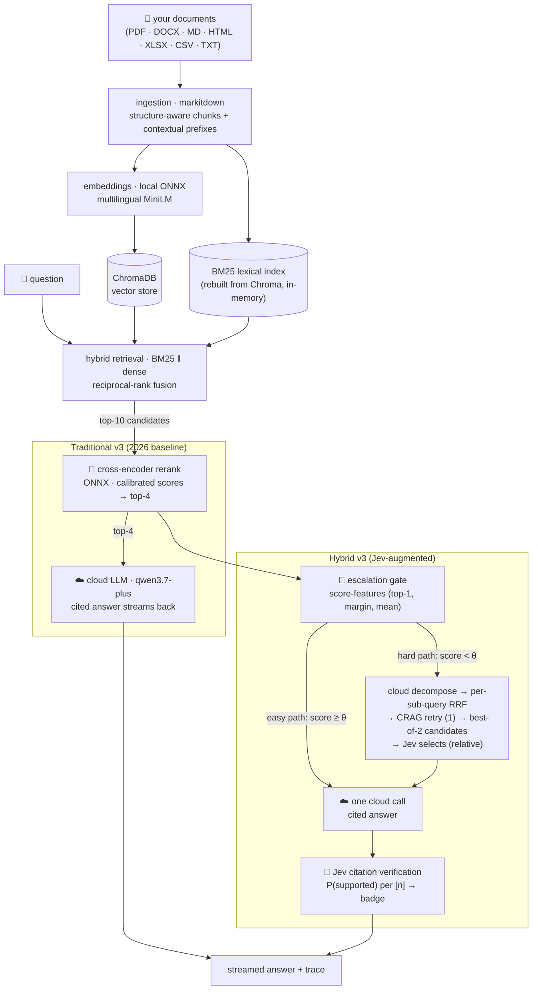

<div align="center">
  
</div>

<br/>

# Jev-RAG

**One app, two retrieval-augmented pipelines over your own documents —
and a built-in benchmark lab that measures, with an independent LLM judge,
exactly what the hybrid adds.**

[](https://github.com/kanishka-namdeo/jev-rag/actions/workflows/ci.yml)
[](LICENSE)
[](backend/)
[](src/)
[](#-how-it-works)
[](CONTRIBUTING.md)

**+9.8pp** correctness on public single-hop questions (v3, Wilcoxon p = 0.048) ·
**+5.1pp** pooled across five public benchmarks · **0** fabrications ·
hybrid runs **cheaper** than the baseline ($0.148 vs $0.165 per 98-question suite)

<br/>

📸 [The app](#-the-app) · ⚡ [Quickstart](#-quickstart) · 🧠 [How it works](#-how-it-works) · 📊 [Results](#-results-with-receipts) · 📁 [Repo tour](#-repo-tour) · 🤝 [Contributing](#-contributing)

<div align="center">
  
</div>

---

## 📸 The app

| Chat — both systems side by side, citations & groundedness badges | Trace — every Jev decision, with calibrated probabilities |
| --- | --- |
|  |  |

| Benchmark Lab — six scenarios, one click | Results — judge metrics, per-scenario charts, drill-down |
| --- | --- |
|  |  |

## ✨ What makes it different

**Both pipelines share the 2026-standard retrieval stack** (BM25 ‖ dense + RRF fusion, cross-encoder rerank, contextual-prefix chunking). The hybrid adds a Jev-augmented agentic layer **only on questions that need it**:

| | **Traditional RAG (v3 baseline)** | **Hybrid RAG (v3)** |
| --- | --- | --- |
| **Retrieval** | BM25 ‖ dense + RRF fusion → cross-encoder rerank → top-4 | Same |
| **Escalation gate** | — | **Score-feature gate**: easy questions (high rerank confidence) skip the heavy path |
| **Hard path (when gate fails)** | — | Sub-query decomposition → per-subquery retrieval → CRAG retry → **Jev best-of-2** selection |
| **Verification** | — | **Jev citation verification** on final answer, shown as groundedness badge |
| **Jev decisions** | — | 3 calls on hard path (effort routing, best-of-2, citations) — **NOT** 7 slots |
| **Latency (p50)** | ~20 s | ~41 s on public benchmarks (2.06×) |
| **Cost** | $0.165 / 98 questions | **$0.148 / 98 questions** (cheaper) |
| **Pick it when** | You need the modern baseline with minimal latency | You want extra guardrails on single-hop, recovery on hard questions, and citation verification |

**Key insight from v3 research:** A ~0.5B decision model cannot make reliable *absolute* judgments (sufficiency, relevance thresholds). The v3 design uses Jev only for **relative judgments** (best-of-2 selection, citation verification, chat-vs-doc routing) and delegates the hard sufficiency decision to **calibrated retrieval scores**.

Everything except the cloud LLM endpoint runs **locally**: embeddings (ONNX CPU),
vector store (ChromaDB embedded), the Jev-style decision model (0.53 GB GGUF on
llama.cpp), and storage (SQLite). Answers stream with inline `[1]`-style citations.

<details>
<summary><b>What is "Jev"?</b></summary>

[Jev](https://typesafe.ai/blog/introducing-system-one-models-and-jev) is TypeSafe AI's
closed-weights "System One" decision model — it makes typed, calibrated decisions (it
never generates text). This project uses its open-source, locally-runnable equivalent:
[Jev-Style-0.8B-Decision-v3](https://huggingface.co/chaoliangUNSW/Jev-Style-0.8B-Decision-v3-GGUF)
(Apache-2.0) via the [jev-style](https://github.com/lawrence3699/jev-style) package,
with a custom llama.cpp scorer. The cloud "System Two" is an OpenAI-compatible
Dashscope endpoint.

**What changed in v3:** The v2 pipeline used Jev for 7 decision slots, including absolute sufficiency gating. The v3 research showed this caused a single-hop regression (−7.3pp). The current design limits Jev to relative judgments where small models perform well, and uses cross-encoder scores for the escalation gate. Full rationale: [docs/rag-upgrade-2026.md](docs/rag-upgrade-2026.md).

</details>

## ⚡ Quickstart

Prereqs: Python 3.12 + [uv](https://docs.astral.sh/uv/), [bun](https://bun.sh), ~2 GB
disk for local models, and an OpenAI-compatible endpoint key.
**New machine?** Follow the full, re-validated guide: **[docs/setup.md](docs/setup.md)**.

```bash
# 1) backend config
cp backend/.env.example backend/.env    # then set JEVRAG_DASHSCOPE_API_KEY

# 2) local models: Jev-Style GGUF + llama.cpp build of the jev-score scorer (~10 min)
bash scripts/setup_local_models.sh

# 3) backend venv (uv)
bash scripts/setup_backend.sh

# 4) frontend deps + run everything
bun install
bash scripts/dev.sh                    # backend :8000 + frontend :3000
```

Open http://localhost:3000, upload documents in the sidebar, and ask questions in any
of the three modes (Traditional / Hybrid · Jev / Compare). To reproduce the numbers
below: open the **Benchmarks** tab and run all six scenarios (~40–100 min on 2 cores,
a few cents of endpoint spend). All five public benchmark scenarios ship in the repo —
a fresh clone runs them with zero dataset downloads
([details](docs/setup.md#running-the-benchmarks)). Stuck? The
[troubleshooting table](docs/setup.md#troubleshooting) covers the common cases.

## 🧠 How it works



### v3 Architecture Changes

| Component | v2 (2026-09-28) | v3 (2026-09-29) | Why |
| --- | --- | --- | --- |
| **Sufficiency gate** | Jev noul (absolute P) | **Removed** → score-feature escalation gate | 0.8B model cannot make reliable absolute sufficiency judgments; gate inversion fixes single-hop regression |
| **Rerank** | Jev noul per passage | **Cross-encoder** (ONNX, 149M) | 10× faster, better calibrated; Jev rerank optional (testbench arm) |
| **Retrieval** | Dense only | **BM25 ‖ dense + RRF** | Rescues lexical/entity lookups; standard 2026 practice |
| **Jev decisions** | 7 slots (effort, rerank, battery, sufficiency, selection, citations, quality) | **3 slots** (effort routing, best-of-2, citations) | Heavy stages only on hard path; relative judgments only |
| **Passage battery** | 3 nouls/passage | **OFF by default** | Miscalibrated absolute thresholds caused −20.8pp regression |
| **Latency ratio** | ~3× | **~2×** | Hard path runs less often; cross-encoder faster than Jev rerank |

### How the escalation gate works

The gate decides whether a question needs the expensive hard path **after** cheap retrieval, not before:

1. **Retrieve + rerank** → cross-encoder scores for top-10 candidates
2. **Score-feature gate** checks: top-1 score, top1−top2 margin, top-k mean, count-above-floor
3. **Threshold θ calibrated** on labeled eval data (gold-in-top-4) using Youden J
4. **Easy path** (score ≥ θ): one LLM call, Jev verifies citations → done
5. **Hard path** (score < θ): decomposition, multi-step retrieval, CRAG retry, best-of-2 selection, verification

This is the Adaptive-RAG pattern without the pre-retrieval router — the retrieval scores themselves answer the "is this easy?" question.

| Component | Where | What |
| --- | --- | --- |
| Retrieval | 🖥️ local | BM25 ‖ dense (fastembed ONNX) + RRF fusion, cross-encoder rerank (ONNX) |
| Jev-style decision model | 🖥️ local | 0.53 GB GGUF on llama.cpp (`jev-score`) — effort routing, best-of-2, citation verification |
| Storage | 🖥️ local | SQLite (documents, conversations, traces, bench runs) |
| Frontend + backend | 🖥️ local | Next.js 16 + FastAPI |
| Generation (System Two) | ☁️ endpoint | OpenAI-compatible Dashscope: `qwen3.7-plus` |

Wire protocol: [docs/api.md](docs/api.md) · full architecture:
[docs/architecture.md](docs/architecture.md) · v3 design rationale:
[docs/rag-upgrade-2026.md](docs/rag-upgrade-2026.md).

## 📊 Results, with receipts

**v3 headline (2026-09-29)** — both pipelines upgraded to 2026-standard retrieval, isolating what the Jev-augmented layer adds on top of a modern baseline. Run `16814bd5`: 98 questions, 5 public benchmarks, independent judge (`kimi-k2.5`), matched context budget:

| v3 headline (98 public questions) | Traditional v3 | Hybrid v3 | Δ |
| --- | --- | --- | --- |
| **Correctness (pooled)** | 61.7% | **66.8%** | **+5.1pp** · CI [−0.5, +10.7] · p = 0.065 |
| **Single-hop subset (n=41)** | 80.5% | **90.2%** | **+9.8pp · CI [+2.4, +19.5] · Wilcoxon p = 0.048 ✓** |
| Multi-hop subset (n=57) | 48.2% | 50.0% | +1.8pp · n.s. |
| Over-abstention (answerable Q) | 35.7% | **25.5%** | −10.2pp |
| Latency p50 | 19.9 s | 40.9 s | 2.06× (was 3× in v2) |
| Cost per suite | $0.165 | **$0.148** | hybrid cheaper |

### What these numbers mean

1. **The v2 single-hop regression is fixed and inverted.** The gate inversion (decide sufficiency AFTER retrieval, from calibrated scores, not by asking a 0.5B model for absolute judgments) did what the calibration literature predicted. Single-hop questions that the v2 gate falsely rejected now pass the easy path and get answered correctly.

2. **The multi-hop edge compressed because the baseline got that good.** The upgraded retrieval (RRF + cross-encoder) lifted the traditional arm's multi-hop performance (Hotpot 0.66→0.80, MuSiQue 0.125→0.19). The modern baseline ate most of the v2 multi-hop win. The hybrid still wins pooled, answers more, abstains less, and costs less.

3. **The escalation gate works as intended.** 10/98 questions escalated (10.2%), gate accuracy vs answerability 0.898, Brier 0.103 (vs v2 jev gate's 0.72 acc / 0.38 Brier). Of the 10 escalated, 6 answered correctly after hard-path recovery, 4 abstained honestly (gold never retrieved).

Full statistics and per-scenario table: [docs/rag-upgrade-2026-results.md](docs/rag-upgrade-2026-results.md).

<details>
<summary><b>Historical: v2 numbers (pre-upgrade)</b></summary>

The v2 pipeline measured a **single-hop regression** (−7.3pp on public data) caused by the absolute sufficiency gate. The full story is in [docs/benchmark-results.md](docs/benchmark-results.md); key runs:

| Run | Traditional | Hybrid v2 | Δ | Notes |
| --- | --- | --- | --- | --- |
| `bf05f585` (battery off) | 87.5% | 92.7% | +5.2pp (n.s.) | Shipped v2 default |
| `0314ac0a` (battery on) | 83.3% | 62.5% | **−20.8pp** | Battery's absolute thresholds miscalibrated |
| Public wave 1 + 2 | 59.2% | 66.8% | +7.6pp | Multi-hop +18.4pp, single-hop **−7.3pp** |

The v3 upgrade fixed the single-hop regression by removing the absolute gate. Multi-hop wins from v2 were absorbed by the upgraded baseline.

Methodology: independent LLM judge (`kimi-k2.5`), position-swapped pairwise, 8/8 canary self-test — [docs/benchmarking.md](docs/benchmarking.md).

</details>

<details>
<summary><b>Historical: v1 numbers</b></summary>

Six document scenarios × 48 ground-truth questions:

| Headline (48 Q, pooled) | Traditional | Hybrid v1 | Δ |
| --- | --- | --- | --- |
| Correctness (judge) | 85.4% | **93.8%** | +8.4pp |
| Over-abstention | 14% | **2.3%** | −11.7pp |
| Fabrications | 0% | 0% | = |
| Latency p50 | 1.5 s | 30.5 s | +29 s |

The v1 design (4 slots: rerank, sufficiency, routing, verification) worked well on the internal suite but the public benchmarks exposed the single-hop issue in v2.

</details>

## ⚙️ Configuration

Everything lives in `backend/.env` (`cp backend/.env.example backend/.env`). Key variables:

| Variable | Default | Meaning |
| --- | --- | --- |
| `JEVRAG_DASHSCOPE_API_KEY` | — | your key (never commit) |
| `JEVRAG_DASHSCOPE_BASE_URL` | `https://coding-intl.dashscope.aliyuncs.com/v1` | any OpenAI-compatible `/v1` endpoint |
| `JEVRAG_LLM_MODEL_DEFAULT` | `qwen3.7-plus` | the single System Two generator |
| `JEVRAG_HYBRID_VERIFY_ANSWERS` | `true` | Jev citation verification (off = faster) |
| `JEVRAG_HYBRID_BEST_OF_N` | `true` | Jev best-of-2 selection on hard path |
| `JEVRAG_HYBRID_PASSAGE_BATTERY` | **`false`** | screening battery (OFF by default after v2 regression) |

<details>
<summary><b>All configuration variables</b></summary>

| Variable | Default | Meaning |
| --- | --- | --- |
| `JEVRAG_LLM_MODEL_REASONING` | `qwen3.6-plus` | optional override for best-of-2 candidate B |
| `JEVRAG_JEV_MODEL_DIR` | `./models/jev-style` | Jev-Style GGUF folder |
| `JEVRAG_JEV_QUANT` | `Q4_K_M` | GGUF quantization |
| `JEVRAG_JEV_SCORER` | `./models/jev-style/build/jev-score` | scorer binary |
| `JEVRAG_EMBED_MODEL` | `sentence-transformers/paraphrase-multilingual-MiniLM-L12-v2` | fastembed model |
| `JEVRAG_TOP_K_RETRIEVE` / `JEVRAG_TOP_K_USE` | `10` / `4` | candidates for rerank / passages to LLM |
| `JEVRAG_JEV_NO_RETRIEVAL_THRESHOLD` | `0.9` | effort routing fast-path threshold |
| `JEVRAG_JEV_CITATION_CONFIDENCE` | `0.8` | citation auto-accept confidence |
| `JEVRAG_HYBRID_*` / `JEVRAG_JEV_*` | see `.env.example` | v2 legacy slots (battery, thresholds) |

Latency knobs: disable verification (`HYBRID_VERIFY_ANSWERS=false`), reduce `TOP_K_RETRIEVE`, or increase `JEV_SCORE_N_CTX` — see [docs/hybrid-design.md](docs/hybrid-design.md).

</details>

## 🧪 Benchmark Lab

Six scenario corpora (26 documents, 48 ground-truth QA pairs) authored to stress
different failure modes:

| Scenario | What it stresses |
| --- | --- |
| Tech product docs | single-hop factoid QA |
| Earnings reports (×2 companies) | near-identical distractor numbers |
| Corporate policies | conditional rules (if X then Y, exceptions) |
| Support KB (6 near-duplicates) | needle-in-haystack retrieval |
| Multilingual exhibition (EN/ZH/DE/FR) | cross-lingual retrieval |
| Cooking corpus + OoS | abstention when the answer isn't in the corpus |

Both pipelines answer every question under a matched context budget, then get scored
by: deterministic retrieval metrics (hit@k, MRR, recall@k, nDCG@10, rerank lift, gate
accuracy + Brier) · an independent LLM judge for RAGAS-style correctness/faithfulness
and 3-way abstention classification · MT-Bench-style pairwise verdicts with position
swap and a consistency audit.

## 📁 Repo tour

```
backend/          FastAPI app — pipelines, Jev engine, ingestion, storage, benchmark harness, tests
  app/bench/      benchmark scenarios, corpora, metrics, judge, runner
  app/rag/        retrieval, dual pipelines, prompts, ingestion
  app/llm/        Dashscope client + local Jev-style engine
src/              Next.js frontend — chat, trace panel, documents, benchmarks dashboard, store
scripts/          setup / build / run scripts (+ decision experiments, bench export)
docs/             architecture · hybrid design · v3 upgrade research · benchmarking + results
```

| Doc | What's inside |
| --- | --- |
| [docs/setup.md](docs/setup.md) | **fresh-system setup guide** — requirements, steps, verification, troubleshooting |
| [docs/architecture.md](docs/architecture.md) | components, data flow, deployment topology |
| [docs/rag-upgrade-2026.md](docs/rag-upgrade-2026.md) | **v3 design rationale** — research synthesis, gate inversion, Jev re-placement |
| [docs/hybrid-design.md](docs/hybrid-design.md) | v2 decision slots (historical), Jev-faithful patterns, knobs |
| [docs/api.md](docs/api.md) | REST + SSE wire protocol |
| [docs/benchmarking.md](docs/benchmarking.md) | methodology, metrics, judge design, fairness checklist |
| [docs/benchmark-results.md](docs/benchmark-results.md) | full runs: v1, v2, public benchmarks |
| [CHANGELOG.md](CHANGELOG.md) | milestone-by-milestone history of what was built |

Tests: `cd backend && .venv/bin/python -m pytest tests -v` (hermetic — no models, no
network) · Lint: `bun run lint` · both run in [CI](.github/workflows/ci.yml).

## 🤝 Contributing

Issues and pull requests are welcome — bug reports with repro steps, benchmark
scenario ideas, and docs fixes especially. See **[CONTRIBUTING.md](CONTRIBUTING.md)**
for the dev setup (one command), the test/lint bar, and what a good PR here looks
like.

## 🔒 Security

Found something security-relevant (leaked credentials, injection vectors, unsafe
defaults)? Please don't open a public issue — see **[SECURITY.md](SECURITY.md)**.

## 🙏 Credits

- [Jev / System One Models](https://typesafe.ai/blog/introducing-system-one-models-and-jev) —
  the decision-model pattern this project adapts locally.
- [Jev-Style-0.8B-Decision-v3](https://huggingface.co/chaoliangUNSW/Jev-Style-0.8B-Decision-v3-GGUF)
  (Apache-2.0) · [jev-style](https://github.com/lawrence3699/jev-style) · [llama.cpp](https://github.com/ggml-org/llama.cpp)
- [RAGAS](https://docs.ragas.io) · [DeepEval](https://deepeval.com) ·
  [LLM-as-a-judge](https://arxiv.org/abs/2306.05685) — metric definitions the judge follows.
- Built on FastAPI · ChromaDB · fastembed · markitdown · langchain-text-splitters ·
  Next.js 16 · Tailwind CSS 4 · shadcn/ui · zustand · recharts.

## 📜 License

Apache-2.0 — see [LICENSE](LICENSE).

<details>
<summary><b>📚 Milestones</b></summary>

| Date | Milestone |
| --- | --- |
| 2026-09-27 | [`a976e87`](https://github.com/kanishka-namdeo/jev-rag/commit/a976e87) — working hybrid RAG system: dual pipelines, local Jev engine, streaming UI with traces |
| 2026-09-27 | [`ab7daae`](https://github.com/kanishka-namdeo/jev-rag/commit/ab7daae) — DOX framework (AGENTS.md hierarchy), docs, CI, self-healing backend |
| 2026-09-27 | [`472c2a0`](https://github.com/kanishka-namdeo/jev-rag/commit/472c2a0) — benchmarking harness: scenarios, metrics, independent judge, pairwise |
| 2026-09-27 | [`be74274`](https://github.com/kanishka-namdeo/jev-rag/commit/be74274) · [`48b94f5`](https://github.com/kanishka-namdeo/jev-rag/commit/48b94f5) · [`77993b2`](https://github.com/kanishka-namdeo/jev-rag/commit/77993b2) — OOM-resilient Jev engine + run hygiene for long local-model runs |
| 2026-09-27 | [`3a950d2`](https://github.com/kanishka-namdeo/jev-rag/commit/3a950d2) — Benchmarks Lab UI + full 48-question run: hybrid +8.4pp correctness |
| 2026-09-28 | [`a1f0461`](https://github.com/kanishka-namdeo/jev-rag/commit/a1f0461) — README, screenshots, license, changelog + fixed empty per-scenario Hit@4/MRR charts |
| 2026-09-28 | [`08a6db5`](https://github.com/kanishka-namdeo/jev-rag/commit/08a6db5) — research: Jev-style decisions beyond model routing + single-LLM design |
| 2026-09-28 | [`44323fb`](https://github.com/kanishka-namdeo/jev-rag/commit/44323fb) — **hybrid v2 pipeline**: effort routing, screening battery, corrective retry, best-of-2, citation verification, composite quality |
| 2026-09-28 | [`42e2c7f`](https://github.com/kanishka-namdeo/jev-rag/commit/42e2c7f) · [`bb7a8b4`](https://github.com/kanishka-namdeo/jev-rag/commit/bb7a8b4) — public RAG benchmarks wave 1: SQuAD v1.1 + HotpotQA scenarios, split verdict |
| 2026-09-28 | [`9d829a6`](https://github.com/kanishka-namdeo/jev-rag/commit/9d829a6) · [`89f9d1b`](https://github.com/kanishka-namdeo/jev-rag/commit/89f9d1b) — public benchmarks wave 2: TriviaQA + 2WikiMultiHopQA + MuSiQue — five-benchmark suite, multi-hop sweep |
| 2026-09-28 | [`aab887a`](https://github.com/kanishka-namdeo/jev-rag/commit/aab887a) — **portability hardening + fresh-system setup guide** ([docs/setup.md](docs/setup.md)): repo-root path anchoring, machine-independent scripts, secrets out of the endpoint probe, CI trigger fix |
| 2026-09-29 | [`1367c56`](https://github.com/kanishka-namdeo/jev-rag/commit/1367c56) — history scrub: leaked DashScope API key replaced, ~1.5k `.next/` build-cache blobs purged from every commit (git-filter-repo rewrite + force-push) |
| 2026-09-29 | [`b272649`](https://github.com/kanishka-namdeo/jev-rag/commit/b272649) · [`55f33de`](https://github.com/kanishka-namdeo/jev-rag/commit/55f33de) · [`227c495`](https://github.com/kanishka-namdeo/jev-rag/commit/227c495) · [`089e3f3`](https://github.com/kanishka-namdeo/jev-rag/commit/089e3f3) — **v3 retrieval upgrade**: BM25‖dense+RRF, contextual-prefix chunking, cross-encoder rerank |
| 2026-09-29 | [`48cc0b1`](https://github.com/kanishka-namdeo/jev-rag/commit/48cc0b1) — bench refactor: both arms drive the SAME ChatService orchestrator (structural arm parity) |
| 2026-09-29 | [`1b4d827`](https://github.com/kanishka-namdeo/jev-rag/commit/1b4d827) — **hybrid v3: gate inversion** — score-feature escalation gate, Jev limited to relative judgments, single-hop regression fixed |
| 2026-09-29 | [`23f3012`](https://github.com/kanishka-namdeo/jev-rag/commit/23f3012) · [`e3e92a0`](https://github.com/kanishka-namdeo/jev-rag/commit/e3e92a0) · [`3eaf3b6`](https://github.com/kanishka-namdeo/jev-rag/commit/3eaf3b6) — **hypothesis testbench** + measured v3 verdict: single-hop +9.8pp significant, multi-hop edge compressed, hybrid cheaper |

</details>

<details>
<summary><b>🤖 Working on this repo (humans and agents)</b></summary>

This repo uses the [DOX](https://github.com/agent0ai/dox) AGENTS.md hierarchy: read the
root `AGENTS.md` (and the nearest child doc) before editing, and run a DOX pass after
meaningful changes. Project-wide contracts (local-first, popular-OSS-first, no secrets
in git, live-browser verification for UI work, green tests/lint, push at milestones)
are binding for any agent regardless of ad-hoc instructions — see
`AGENTS.md → Project-Wide Contracts`.

</details>