<div align="center">
  
</div>

<br/>

# Jev-RAG

**Local-first hybrid RAG over your own documents — with intelligent routing and grounded answers.**

[](https://github.com/kanishka-namdeo/jev-rag/actions/workflows/ci.yml)
[](LICENSE)
[](backend/)
[](src/)
[](#-how-it-works)
[](CONTRIBUTING.md)

**+9.8pp** correctness on single-hop questions · **+5.1pp** pooled across five public benchmarks · **0** fabrications · hybrid runs **cheaper** than the baseline

> **Who is this for?** Jev-RAG is for developers and teams who want a local-first, privacy-preserving RAG system with intelligent routing and grounded answers.

<br/>

📸 [Screenshots](#-screenshots) · ⚡ [Quickstart](#-quickstart) · 🧠 [How it works](#-how-it-works) · 📊 [Results](#-results) · 📚 [Documentation](#-documentation) · 🤝 [Contributing](#-contributing)

---

## 📸 Screenshots

<div align="center">
  
</div>

| Chat — both systems side by side, citations & groundedness badges | Trace — every decision, with calibrated probabilities |
| --- | --- |
|  |  |

| Benchmark Lab — six scenarios, one click | Results — judge metrics, per-scenario charts, drill-down |
| --- | --- |
|  |  |

## ✨ Feature highlights

- **Two pipelines, one retrieval stack** — both use BM25 + dense retrieval with cross-encoder reranking. The hybrid adds intelligent routing on top.
- **Local-first, privacy-preserving** — embeddings, vector store, decision model, and storage all run on your machine. Only the final LLM call goes to a cloud endpoint.
- **Smart escalation** — easy questions skip the heavy path. Hard questions get decomposition, multi-step retrieval, and verification.
- **Grounded answers** — citation verification shows you exactly where answers come from, with a groundedness badge you can trust.
- **Built-in benchmark lab** — measure correctness, faithfulness, and retrieval quality with an independent LLM judge. Six scenario corpora included.
- **Full transparency** — trace panel shows every decision with calibrated probabilities. You see exactly why the system routed each question.

## ⚡ Quickstart

**Prereqs:** Python 3.12 + [uv](https://docs.astral.sh/uv/), [bun](https://bun.sh), ~2 GB disk for local models, and an OpenAI-compatible API key.

```bash
# 1) Backend config
cp backend/.env.example backend/.env    # then set JEVRAG_DASHSCOPE_API_KEY

# 2) Local models: decision model + llama.cpp scorer (~10 min)
bash scripts/setup_local_models.sh

# 3) Backend venv (uv)
bash scripts/setup_backend.sh

# 4) Frontend deps + run everything
bun install
bash scripts/dev.sh                    # backend :8000 + frontend :3000
```

Open http://localhost:3000, upload documents in the sidebar, and ask questions in any of the three modes (Traditional / Hybrid / Compare).

**New machine?** Follow the full guide: **[docs/setup.md](docs/setup.md)** · **Windows?** See **[docs/windows-setup.md](docs/windows-setup.md)**

## 🧠 How it works

```mermaid
%%{init: {'theme': 'dark', 'themeVariables': { 'primaryColor': '#3B82F6', 'primaryTextColor': '#fff', 'primaryBorderColor': '#60A5FA', 'lineColor': '#94A3B8', 'secondaryColor': '#10B981', 'tertiaryColor': '#8B5CF6', 'background': '#0B0F19' }}}%%
flowchart TB
    subgraph INGESTION["📄 Document Ingestion"]
        UPLOAD["Upload Documents"]
        MARKDOWN["markitdown"]
        CHUNK["Text Splitter"]
        EMBED["fastembed ONNX"]
    end

    UPLOAD --> MARKDOWN --> CHUNK --> EMBED

    CHROMADB[("🗄️ ChromaDB<br/>Vector Store + BM25")]
    EMBED --> CHROMADB

    subgraph QUERY["🔍 Query Processing"]
        USERQUERY["User Query"]
        QUERYEMBED["Embed Query"]
        RETRIEVE["Hybrid Retrieval<br/>BM25 ‖ Dense + RRF"]
        RERANK["Cross-Encoder Rerank<br/>Top-10 → Top-4"]
    end

    USERQUERY --> QUERYEMBED --> RETRIEVE --> RERANK
    CHROMADB --> RETRIEVE

    RERANK --> FORK{⚡}

    subgraph TRADITIONAL["🔵 Traditional Pipeline"]
        TOP4["Top-4 Passages"]
        LLM1["☁️ Cloud LLM<br/>qwen3.7-plus"]
        CITED["✓ Cited Answer"]
    end

    FORK -->|Simple Queries| TOP4 --> LLM1 --> CITED

    subgraph HYBRID["🟢 Hybrid Pipeline"]
        JEV["🧠 Local Decision Model<br/>0.8B GGUF on llama.cpp"]
        EFFORT["1. Effort Routing"]
        GATE["2. Score-Feature Gate"]
        BESTOF["3. Best-of-2 (hard path)"]
        VERIFY["4. Citation Verification"]
        LLM2["☁️ Cloud LLM<br/>qwen3.7-plus"]
        VERIFIED["✓ Verified Answer<br/>+ Groundedness Badge"]
    end

    FORK -->|Complex Queries| JEV
    JEV --> EFFORT --> GATE
    GATE -->|easy| LLM2 --> VERIFY --> VERIFIED
    GATE -->|hard| BESTOF --> LLM2

    subgraph RESPONSE["📡 Response"]
        SSE["SSE Stream"]
        TRACE["Trace Panel"]
        CITATIONS["Citations"]
        BADGE["Groundedness Badge"]
    end

    CITED --> RESPONSE
    VERIFIED --> RESPONSE

    style INGESTION fill:#1E293B,stroke:#3B82F6,stroke-width:2px
    style QUERY fill:#1E293B,stroke:#3B82F6,stroke-width:2px
    style TRADITIONAL fill:#0C4A6E,stroke:#0EA5E9,stroke-width:2px
    style HYBRID fill:#064E3B,stroke:#10B981,stroke-width:2px
    style RESPONSE fill:#1E293B,stroke:#8B5CF6,stroke-width:2px
    style CHROMADB fill:#0C4A6E,stroke:#0EA5E9,stroke-width:3px
    style FORK fill:#475569,stroke:#fff,stroke-width:3px
    style JEV fill:#065F46,stroke:#10B981,stroke-width:2px
```

<div align="center">



  <em>Both pipelines share the retrieval stack. The hybrid adds an escalation gate and local decision model for hard questions.</em>
</div>

**The escalation gate** decides whether a question needs the expensive path *after* cheap retrieval, not before. It uses calibrated retrieval scores (top-1 score, margin, mean) to route: easy questions get one LLM call, hard questions get decomposition, multi-step retrieval, best-of-2 selection, and citation verification. This is the Adaptive-RAG pattern without a pre-retrieval router.

**What is the local decision model?** Jev-RAG uses a small (~0.5B parameter) decision model that runs locally on llama.cpp. It makes typed, calibrated decisions like "which answer is better?" or "is this citation supported?" — it never generates text. The cloud LLM (System Two) handles the actual generation. [Learn more in the glossary](docs/glossary.md).

**Deep dive:** [docs/architecture.md](docs/architecture.md) · [docs/hybrid-design.md](docs/hybrid-design.md)

## 📊 What makes it different

**Both pipelines use the 2026-standard retrieval stack** (hybrid search, cross-encoder reranking, contextual chunking). The hybrid adds intelligent routing **only on questions that need it**:

| | **Traditional RAG** | **Hybrid RAG** |
| --- | --- | --- |
| **Retrieval** | Hybrid search (keyword + semantic) → cross-encoder rerank → top-4 | Same |
| **Smart routing** | — | **Score-feature gate**: easy questions skip the heavy path |
| **Hard questions** | — | Sub-query decomposition → multi-step retrieval → retry → **best-of-2 selection** |
| **Verification** | — | **Citation verification** on final answer, shown as groundedness badge |
| **Local decisions** | — | 3 calls on hard path (effort routing, best-of-2, citations) |
| **Latency (p50)** | ~20 s | ~41 s (2× slower, but only on hard questions) |
| **Cost** | $0.165 / 98 questions | **$0.148 / 98 questions** (cheaper) |
| **Use it when** | You need the modern baseline with minimal latency | You want extra guardrails, recovery on hard questions, and citation verification |

## 📊 Results

<div align="center">

| Metric | Traditional | Hybrid | Δ |
|--------|-------------|--------|---|
| **Correctness (pooled)** | 61.7% | **66.8%** | **+5.1pp** |
| **Single-hop questions** | 80.5% | **90.2%** | **+9.8pp** ✓ |
| Multi-hop questions | 48.2% | 50.0% | +1.8pp |
| Over-abstention | 35.7% | **25.5%** | **−10.2pp** |
| Latency p50 | 19.9s | 40.9s | 2.06× |
| Cost per suite | $0.165 | **$0.148** | **cheaper** |

  <em>v3 headline: +9.8pp on single-hop questions (statistically significant), hybrid runs cheaper than baseline</em>
</div>

**What these numbers mean:** The hybrid fixes the single-hop regression from earlier versions by using calibrated retrieval scores instead of asking a small model for absolute judgments. The escalation gate works as intended — 10% of questions take the hard path, and 60% of those get answered correctly after recovery. The hybrid answers more, abstains less, and costs less.

**Full analysis:** [docs/benchmark-results.md](docs/benchmark-results.md) · **Methodology:** [docs/benchmarking.md](docs/benchmarking.md)

## 📚 Documentation

**Getting started**
- [docs/setup.md](docs/setup.md) — fresh-system setup guide (requirements, steps, verification, troubleshooting)
- [docs/windows-setup.md](docs/windows-setup.md) — Windows-specific setup with WSL2

**Understanding the system**
- [docs/architecture.md](docs/architecture.md) — components, data flow, deployment topology
- [docs/hybrid-design.md](docs/hybrid-design.md) — decision patterns, escalation gate, configuration knobs
- [docs/rag-upgrade-2026.md](docs/rag-upgrade-2026.md) — v3 design rationale and research synthesis

**Benchmark results**
- [docs/results.md](docs/results.md) — **start here**: headline numbers, key findings, v1→v2→v3 progression
- [docs/benchmark-results.md](docs/benchmark-results.md) — full run history with per-scenario breakdowns
- [docs/benchmarking.md](docs/benchmarking.md) — methodology, metrics, judge design, fairness checklist

**API reference**
- [docs/api.md](docs/api.md) — REST + SSE wire protocol

**Glossary**
- [docs/glossary.md](docs/glossary.md) — key terms and concepts

## 🤝 Contributing

Issues and pull requests are welcome — bug reports with repro steps, benchmark scenario ideas, and docs fixes especially. See **[CONTRIBUTING.md](CONTRIBUTING.md)** for the dev setup (one command), the test/lint bar, and what a good PR looks like.

## 🔒 Security

Found something security-relevant (leaked credentials, injection vectors, unsafe defaults)? Please don't open a public issue — see **[SECURITY.md](SECURITY.md)**.

## 🙏 Credits

- [Jev / System One Models](https://typesafe.ai/blog/introducing-system-one-models-and-jev) — the decision-model pattern this project adapts locally
- [Jev-Style-0.8B-Decision-v3](https://huggingface.co/chaoliangUNSW/Jev-Style-0.8B-Decision-v3-GGUF) (Apache-2.0) · [jev-style](https://github.com/lawrence3699/jev-style) · [llama.cpp](https://github.com/ggml-org/llama.cpp)
- [RAGAS](https://docs.ragas.io) · [DeepEval](https://deepeval.com) · [LLM-as-a-judge](https://arxiv.org/abs/2306.05685) — metric definitions the judge follows
- Built on FastAPI · ChromaDB · fastembed · markitdown · langchain-text-splitters · Next.js 16 · Tailwind CSS 4 · shadcn/ui · zustand · recharts

## 📜 License

Apache-2.0 — see [LICENSE](LICENSE).
