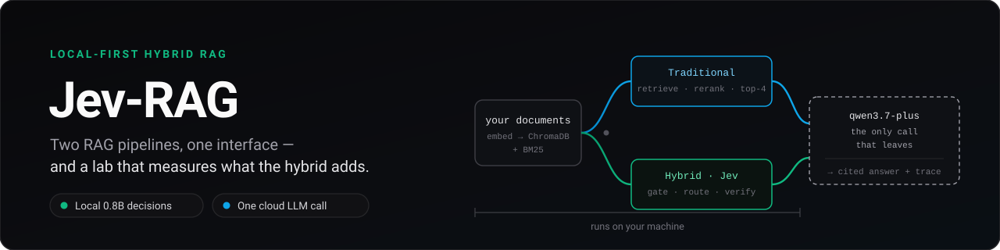
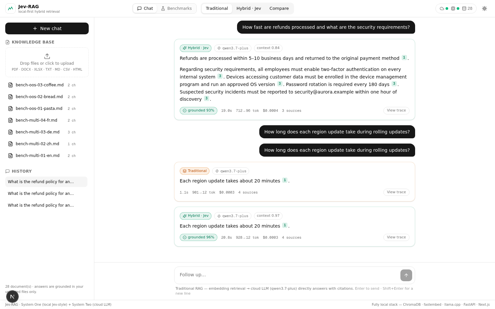
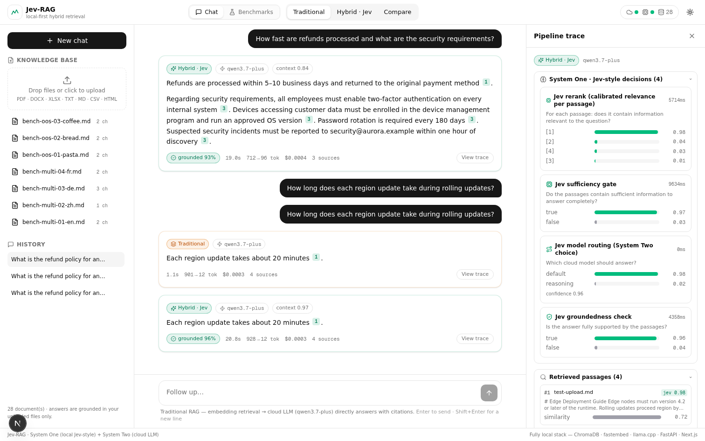
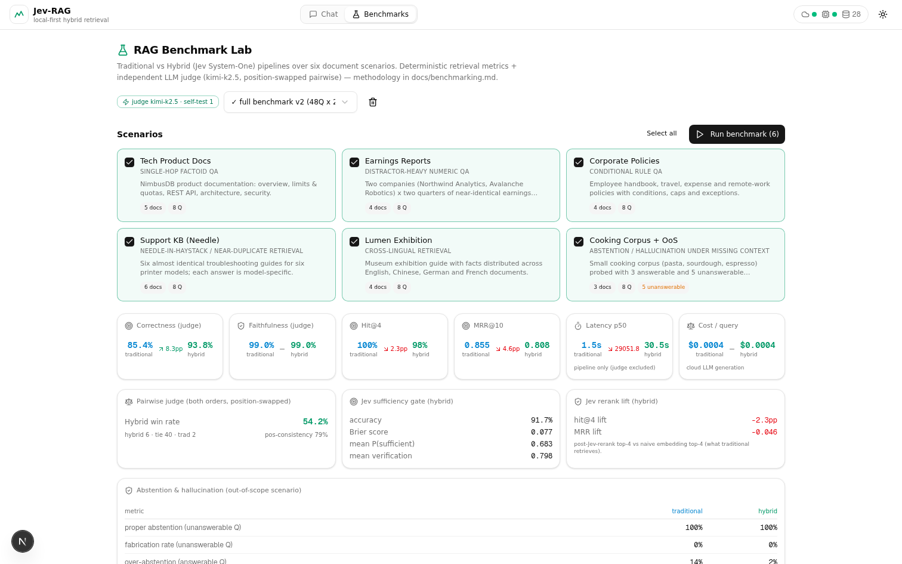
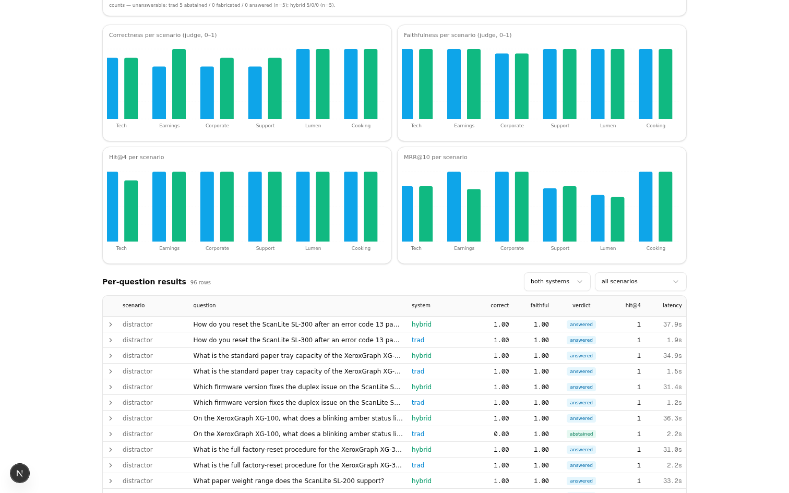
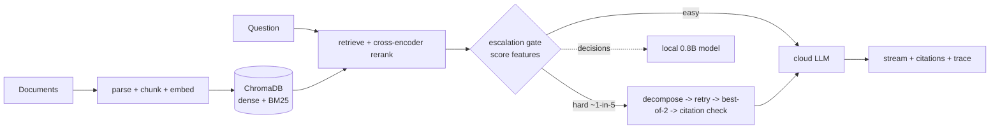

<div align="center">
  
</div>

# Jev-RAG

**Local-first hybrid RAG over your own documents: ask questions, get cited answers — and a benchmark lab that measures exactly what the hybrid adds.**

[](https://github.com/kanishka-namdeo/jev-rag/actions/workflows/ci.yml)
[](LICENSE)
[](backend/)
[](src/)

## What it does

Drop documents on your machine, ask questions about them, and get streamed answers with `[n]` citations you can trace back to the exact passages.

- **Upload** — 11 extensions: `.pdf` `.docx` `.xlsx` `.md` `.txt` `.html` `.htm` `.csv` `.json` `.xml` `.log` (25 MiB per file, 10 files per request).
- **Ask in three modes** — **Traditional** (hybrid BM25 + dense retrieval → cross-encoder rerank → one cloud LLM call) or **Hybrid** (plus a local 0.8B Jev-style decision model that gates, decomposes, retries, picks the best of two candidates and verifies citations) — or run both side by side in **Compare**.
- **Measure** — a built-in Benchmark Lab runs both pipelines over 11 shipped question sets and grades them with an independent LLM judge.

## Who it's for — and who it's not

Built for **one person on one machine** (or one trusted team on a shared workstation) who wants their corpus to never leave their disk and their answers to be checkable.

It is **not** multi-tenant: no user accounts, no per-user ACLs — one SQLite database holds a single shared knowledge base. It is **not** fully offline: your document content goes to exactly **one** destination outside your machine — the cloud LLM endpoint in `backend/.env` — but on the hybrid path that endpoint may be called more than once per answer (see [Privacy](#privacy-what-stays-local)). And it ships **no authentication** — the server listens on loopback only, which is the safety model (see [SECURITY.md](SECURITY.md)).

## Screenshots

<div align="center">
  
</div>

| Trace panel — every local decision, with calibrated probabilities | Benchmark Lab — pick scenarios, run both arms |
| --- | --- |
|  |  |
|  | |

## Requirements

| | Minimum | Comfortable |
| --- | --- | --- |
| CPU | 2 cores | 4+ cores |
| RAM | 4 GB | 8 GB |
| Disk | ~5 GB free | 8 GB |
| OS | Linux, macOS, Windows via WSL2 | — |
| GPU | not required — jev-score uses CUDA when present; embedder and reranker fall back to CPU (ONNX Runtime does not support WSL2 GPU passthrough) | |

Local models total ~0.53 GB for the decision model plus ~225 MB for the embedder and ~91 MB for the reranker, downloaded on first use.

```bash
# 1) Backend config
cp backend/.env.example backend/.env    # then set JEVRAG_DASHSCOPE_API_KEY
# 2) Local models: decision model + llama.cpp scorer (the compile dominates the time budget)
bash scripts/setup_local_models.sh
# 3) Backend venv (uv)
bash scripts/setup_backend.sh
# 4) Frontend deps + run everything
bun install
bash scripts/dev.sh                     # backend :8000 + frontend :3000
```

Open http://localhost:3000 — allow ~15 min total on a 2-core/4 GB machine. **Full guide:** [docs/setup.md](docs/setup.md) · **Windows:** [docs/windows-setup.md](docs/windows-setup.md)

## Which mode should I use

| Mode | What runs | What you get | Rough latency |
| --- | --- | --- | --- |
| **Traditional** | hybrid retrieval → cross-encoder rerank → one cloud call | cited answer | ~20 s p50 measured on 2 cores |
| **Hybrid · Jev** | the above plus effort routing, an escalation gate, sub-query decomposition, corrective retry, best-of-2 and citation verification | cited answer + groundedness and quality badges + full decision trace | ~41 s p50 overall (same 2-core sandbox); only ~1 in 5 questions take the heavy path, and those cost more |
| **Compare** | both of the above, concurrently, in one browser request pair | the two answers side by side | both at once |

Compare is not a third pipeline: the frontend runs the other two side by side (`src/lib/jevrag/store.ts`). The groundedness badge only ever appears on hybrid answers, because the traditional path does not run citation verification.

What the hybrid adds is **mechanism, not a guaranteed win**: extra local decisions, recovery on the hard path, and citation verification — at ~2× latency on escalated questions and a lower per-suite cloud bill. On the 9-arm Layer-2 rerun none of those components beat the plain baseline at FDR q < 0.05 ([docs/testbench-results-layer2-full9.md](docs/testbench-results-layer2-full9.md)), so treat them as guardrails and instrumentation you can measure in your own Benchmark Lab.

## How it works



*Both pipelines share the retrieval stack; the hybrid gates on calibrated retrieval scores and only spends the heavy path where it might pay.*

**The escalation gate** decides whether a question needs the expensive path *after* cheap retrieval, not before: it reads score features (top-1 score, margin, mean) from the reranked passages, routes easy questions to a single LLM call, and sends the roughly 1-in-5 hard questions (at the shipped gate threshold) through decomposition, retry, best-of-2 selection and citation verification.

**The local decision model** is a 0.8B Jev-style GGUF running on llama.cpp. It makes typed, calibrated decisions — "is this passage relevant?", "which candidate is better?", "is this citation supported?" — and never generates prose; the cloud LLM writes the answer. [Learn more in the glossary](docs/glossary.md).

**Deep dive:** [docs/architecture.md](docs/architecture.md) · [docs/hybrid-design.md](docs/hybrid-design.md)

## Results

| | v3 headline `16814bd5` | Layer-2 9-arm `36abefc6` |
| --- | --- | --- |
| **Claim** | +5.1 pp pooled (CI [−0.5, +10.7], p = 0.065); **+9.8 pp single-hop, n = 41 (CI [+2.4, +19.5], p = 0.048)**; multi-hop +1.8 pp, n.s. | **0 / 9 arms beat `base` at FDR q < 0.05** |
| **Gate** | hybrid abstains 10.2 pp less (25.5 % vs 35.7 %) | marginal value over never-escalating: +2.5 pp, p = 0.549 |
| **Cost** | $0.148 vs $0.165 per suite | forced escalation is pure cost: 3.71× median latency, replicated in both draws |

Conditions: 98 questions × 5 public scenarios; independent judge (`kimi-k2.5`, a different model family from the generators), position-swapped pairwise, 8/8 canary self-test; latency measured on a 2-core sandbox, not a workstation.

**A single Layer-2 draw is not a finding** — re-running the four M11 arms a day apart flipped `oracle-gate`'s delta from −3.6 pp to +2.5 pp. Quote both draws or neither.

Fabrication is only measured on the five unanswerable questions in the internal `outofscope` scenario, and the two 0/5 runs bracket the bad draw rather than closing it: the first internal run, `9d894b6c` (hybrid v1), and the last one that measured it, `bf05f585` (hybrid v2 with the passage battery off), both scored 0/5; the intervening `0314ac0a` (v2, battery on) measured 1/5 — the no-retrieval fast path answered one question from parametric knowledge. **The v3 pipeline has not had its fabrication rate published.** The public benchmark suites contain no unanswerable questions, so no public run can produce this metric — see [docs/benchmarking.md](docs/benchmarking.md).

**Full record:** [docs/results.md](docs/results.md) · **Methodology:** [docs/benchmarking.md](docs/benchmarking.md) · **9-arm suite:** [docs/testbench-results-layer2-full9.md](docs/testbench-results-layer2-full9.md)

## Privacy: what stays local

Everything that touches your documents runs on your machine: parsing, chunking,
embeddings, the vector store, BM25, the reranker, the local decision model, and the
SQLite database. What leaves is cloud LLM traffic, and it goes to exactly **one**
destination: the OpenAI-compatible endpoint in `backend/.env`. A traditional answer
makes one call there; a hybrid answer can make several — the hard path generates two
best-of-2 candidates concurrently and a corrective retry may add another — all to
that same endpoint.

The backend binds to `127.0.0.1` by default and has **no authentication**. Set
`JEVRAG_HOST=0.0.0.0` only if you deliberately want other devices on your network to
reach it — they get full read and write access to your documents and conversations.
CORS accepts only the frontend origin. There is no telemetry, no external vector DB and
no embedding API.

CORS is defense-in-depth, not what carries the app's own traffic (the frontend reaches the backend through a server-side Next.js rewrite); DNS rebinding is an admitted residual — see [SECURITY.md](SECURITY.md).

## Documentation

The hub is [docs/README.md](docs/README.md), with three lanes:

- **Use it** — [setup.md](docs/setup.md) · [usage.md](docs/usage.md) · [configuration.md](docs/configuration.md) · [troubleshooting.md](docs/troubleshooting.md), symptom-first: [it won't start](docs/troubleshooting.md#it-wont-start) · [uploads](docs/troubleshooting.md#uploads) · [answers](docs/troubleshooting.md#answers) · [answers are slow](docs/troubleshooting.md#answers-are-slow) · [cost shows —](docs/troubleshooting.md#cost-shows-) · [the backend died](docs/troubleshooting.md#the-backend-died) · [can't reach it from another device](docs/troubleshooting.md#cant-reach-it-from-another-device) · [collecting diagnostics](docs/troubleshooting.md#collecting-diagnostics)
- **Understand it** — [glossary.md](docs/glossary.md) · [architecture.md](docs/architecture.md) · [hybrid-design.md](docs/hybrid-design.md) · [rag-upgrade-2026.md](docs/rag-upgrade-2026.md) · [api.md](docs/api.md) · [setup-gpu.md](docs/setup-gpu.md)
- **Measure it** — [results.md](docs/results.md) (start here) · [benchmarking.md](docs/benchmarking.md) · [testbench-design.md](docs/testbench-design.md) · [testbench-results-layer1.md](docs/testbench-results-layer1.md) · [testbench-results-layer2-full9.md](docs/testbench-results-layer2-full9.md) · [benchmark-results.md](docs/benchmark-results.md)

## Contributing

Issues and pull requests are welcome — bug reports with repro steps, benchmark scenario ideas, and docs fixes especially. See **[CONTRIBUTING.md](CONTRIBUTING.md)** for the dev setup (one command), the test/lint bar, and what a good PR looks like.

## Security

Found something security-relevant (leaked credentials, injection vectors, unsafe defaults)? Please don't open a public issue — see **[SECURITY.md](SECURITY.md)**.

## Credits

- [Jev / System One Models](https://typesafe.ai/blog/introducing-system-one-models-and-jev) — the decision-model pattern this project adapts locally
- [Jev-Style-0.8B-Decision-v3](https://huggingface.co/chaoliangUNSW/Jev-Style-0.8B-Decision-v3-GGUF) (Apache-2.0) · [jev-style](https://github.com/lawrence3699/jev-style) · [llama.cpp](https://github.com/ggml-org/llama.cpp)
- [RAGAS](https://docs.ragas.io) · [DeepEval](https://deepeval.com) · [LLM-as-a-judge](https://arxiv.org/abs/2306.05685) — metric definitions the judge follows
- Built on FastAPI · ChromaDB · fastembed · markitdown · langchain-text-splitters · Next.js 16 · Tailwind CSS 4 · shadcn/ui · zustand · recharts

## License

Apache-2.0 — see [LICENSE](LICENSE).
