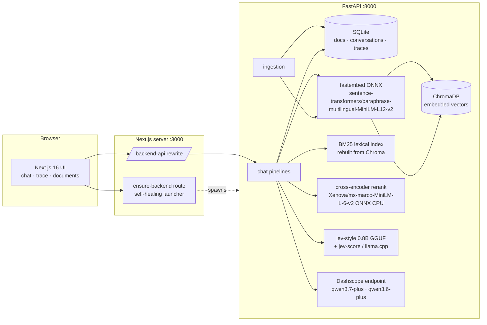
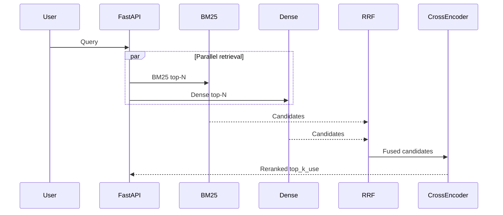
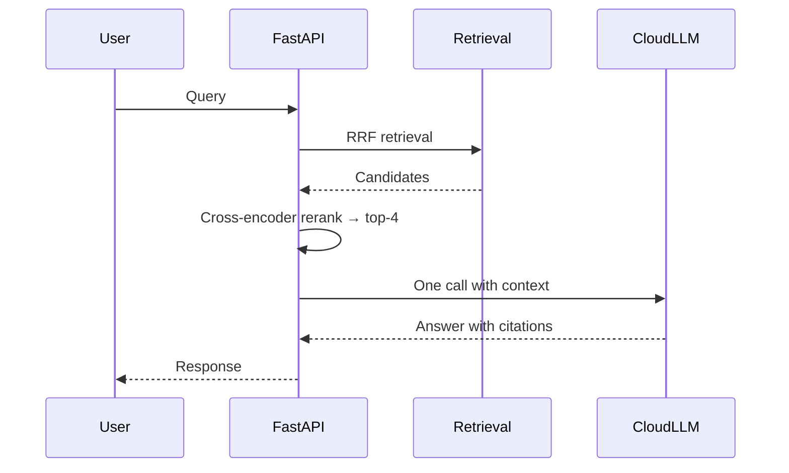
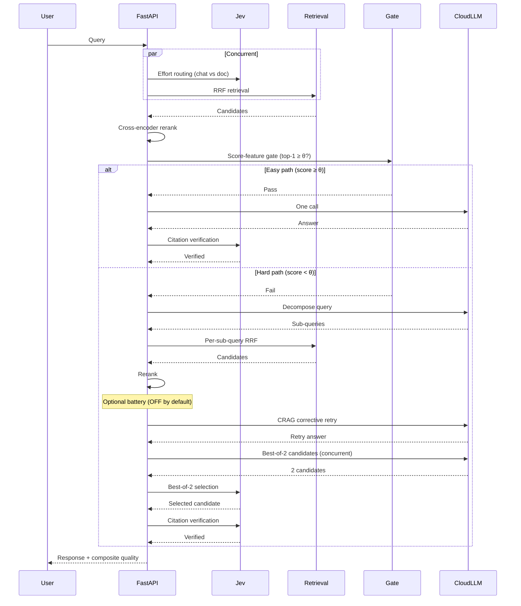

# Architecture

> **TL;DR**: Jev-RAG runs two RAG pipelines side by side: a traditional embedding-retrieval path and a hybrid path where a local decision model ([Jev](glossary.md#jev)) reranks passages, gates context sufficiency, and routes between cloud models. Everything except the cloud LLM endpoint runs on-device.

Jev-RAG is a local-first hybrid [RAG](glossary.md#rag-retrieval-augmented-generation) system: everything except the cloud LLM endpoint runs
on-device.



## Components

| Layer | Choice | Why |
| --- | --- | --- |
| Backend framework | FastAPI + Uvicorn | async SSE streaming, standard OpenAPI ecosystem |
| Parsing | markitdown | PDF/DOCX/XLSX/MD/CSV/HTML → text in one call |
| Chunking | langchain-text-splitters | battle-tested recursive splitting, contextual-prefix aware |
| Embeddings | fastembed (ONNX, CPU) `paraphrase-multilingual-MiniLM-L12-v2` | no torch, ~50 languages, 384-dim |
| Vector store | ChromaDB (embedded, persistent, cosine) | zero-ops local vectors |
| Lexical index | BM25 (rebuilt from Chroma contents, in-memory) | rescues lexical/entity lookups that dense misses |
| Reranker | cross-encoder (ONNX, CPU, batched pairs) | dominates 0.5B generative rerank on quality/$ |
| System One (decisions) | `jev-style` package + Jev-Style-0.8B-Decision-v3-GGUF (Q4_K_M, 0.53 GB) on llama.cpp via `jev-score` | open-source Jev-style typed calibrated decisions — v3 limited to relative judgments only |
| System Two (generation) | Dashscope OpenAI-compatible endpoint | qwen3.7-plus — the single generator |
| Relational store | SQLAlchemy 2 + SQLite | documents registry, conversations, messages + full pipeline traces |
| Frontend | Next.js 16 App Router, TS, Tailwind 4, shadcn/ui, zustand | modern standard stack |

## Data flow (v3 pipelines)

Both pipelines share the v3 retrieval stack; the hybrid adds a Jev-augmented agentic layer
only on questions that need it. See [rag-upgrade-2026.md](rag-upgrade-2026.md) for the
design rationale and [rag-upgrade-2026-results.md](rag-upgrade-2026-results.md) for measured results.

### Shared retrieval stack (both arms)



**Indexing pipeline:** markitdown → structure-aware split (headings, ~900/140 preserved) → contextual prefix ("doc title — section") into chunk text → [dense embed](glossary.md#dense-embedding) (fastembed) into Chroma (cosine) → [BM25](glossary.md#bm25) index over the same chunks (rebuilt lazily from Chroma contents).

**Query pipeline:** [BM25](glossary.md#bm25) top-N ‖ dense top-N → [RRF](glossary.md#rrf-reciprocal-rank-fusion) fusion (k=60) → [cross-encoder](glossary.md#cross-encoder-reranker) rerank (ONNX, CPU, batched pairs) → top_k_use.

### Traditional v3 (= 2026 baseline)



RRF retrieval → cross-encoder rerank → top-4 → **one** cloud call → answer with citations.
No local LLM anywhere.

### Hybrid v3 (escalation design — the gate inversion)



**Effort routing** ([Jev](glossary.md#jev), concurrent with retrieval): decides chat vs doc, P≥0.9 fast path, validated 0.76–0.96 vs ≤0.17 separation.

**Easy path** ([escalation gate](glossary.md#escalation-gate) passes: top-1 rerank score ≥ θ, calibrated on eval data): one cloud call → Jev citation verification → done.

**Hard path** (gate fails: score < θ): cloud decompose → per-sub-query RRF retrieval → rerank → optional passage battery (OFF by default) → CRAG corrective retry (1) → best-of-2 (Jev selects — relative judgment) → one cloud call → Jev citation verification → composite quality.

**Score-feature escalation gate.** The gate decides whether a question needs the
expensive hard path *after* cheap retrieval, not before. It uses calibrated signals
available after retrieval: top-1 cross-encoder score (primary), top1−top2 margin,
top-k mean, count-above-floor. Threshold θ is calibrated on labeled eval data
(gold-in-top-4) using Youden J. This replaces the v2 absolute sufficiency gate
which asked the 0.8B model for a yes/no judgment — a task the calibration literature
and our own measurements showed it could not do reliably.

**Jev re-placement (evidence-driven).** v3 limits Jev to three relative judgments
where small models perform well: effort routing (chat vs doc), best-of-2 selection
(faithful vs planted candidate), and citation verification (per-citation supports/
contradicts/says_nothing). Pointwise rerank and absolute sufficiency gating moved
to cross-encoder and score-features respectively.

**Composite quality score** in code: 0.4·answers_request + 0.4·citations_supported +
0.2·¬contradicts_context; message + full trace persisted, every decision in the UI trace panel.

## What runs where?

Jev-RAG is designed to run entirely on your local machine, with only the cloud LLM endpoint external. Here's the topology:

```
┌─────────────────────────────────────────────────────────────┐
│  Your browser (localhost:3000)                              │
│    ↓ HTTP/SSE                                               │
│  Next.js dev server (:3000)                                 │
│    ↓ /backend-api/* rewrite                                 │
│  FastAPI backend (:8000)                                    │
│    ├─→ ChromaDB (embedded vectors, local SQLite)            │
│    ├─→ fastembed (ONNX CPU, embeddings)                     │
│    ├─→ BM25 index (in-memory, rebuilt from Chroma)          │
│    ├─→ cross-encoder (ONNX CPU, reranking)                  │
│    ├─→ jev-score subprocess (llama.cpp, 0.8B GGUF)          │
│    └─→ Dashscope endpoint (cloud LLM: qwen3.7-plus)  ←──┐  │
└───────────────────────────────────────────────────────────┼──┘
                                                            │
                              External network (HTTPS) ←─────┘
```

**On this system (Windows + WSL2):**
- The browser runs natively on Windows.
- Next.js, FastAPI, and all local models run inside **WSL2 Ubuntu-24.04** at `/mnt/d/test_jev/jev-rag`.
- The GPU (RTX 2070) accelerates `jev-score` via llama.cpp CUDA, but the embedder and cross-encoder fall back to CPU (ONNX Runtime doesn't support WSL2 GPU passthrough — see [setup-gpu.md](setup-gpu.md)).

> **Note**: On native Linux or macOS, all components run directly on the host without WSL2. The GPU can accelerate all three local components if ONNX Runtime CUDA is configured.

## Process topology (sandbox)

- Next.js dev server is platform-managed; it proxies `/backend-api/*` to FastAPI and can
  re-spawn it (`/api/ensure-backend`), making the backend self-healing.
- `jev-score` runs as a persistent JSON-lines subprocess of the FastAPI process; the jev-style
  adapter serializes decisions on one worker thread.
