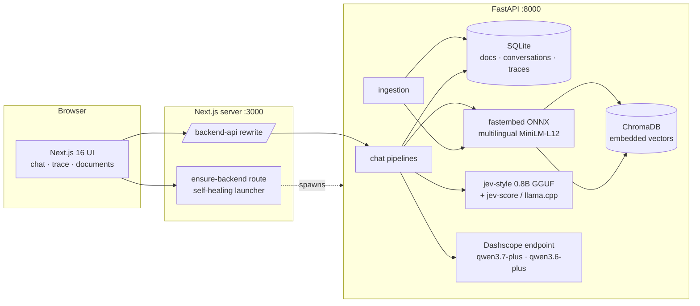

# Architecture

Jev-RAG is a local-first hybrid RAG system: everything except the cloud LLM endpoint runs
on-device.

## Components

| Layer | Choice | Why |
| --- | --- | --- |
| Backend framework | FastAPI + Uvicorn | async SSE streaming, standard OpenAPI ecosystem |
| Parsing | markitdown | PDF/DOCX/XLSX/MD/CSV/HTML → text in one call |
| Chunking | langchain-text-splitters | battle-tested recursive splitting |
| Embeddings | fastembed (ONNX, CPU) `paraphrase-multilingual-MiniLM-L12-v2` | no torch, ~50 languages, 384-dim |
| Vector store | ChromaDB (embedded, persistent, cosine) | zero-ops local vectors |
| System One (decisions) | `jev-style` package + Jev-Style-0.8B-Decision-v3-GGUF (Q4_K_M, 0.53 GB) on llama.cpp via `jev-score` | open-source Jev-style typed calibrated decisions |
| System Two (generation) | Dashscope OpenAI-compatible endpoint | qwen3.7-plus default; qwen3.6-plus reasoning route |
| Relational store | SQLAlchemy 2 + SQLite | documents registry, conversations, messages + full pipeline traces |
| Frontend | Next.js 16 App Router, TS, Tailwind 4, shadcn/ui, zustand | modern standard stack |

## Data flow (hybrid pipeline)

1. Query → embedding (local ONNX) → ChromaDB top-k candidates
2. **Jev rerank** — one `decide()` call, one noul question per passage (calibrated P(relevant))
3. **Jev sufficiency + routing** — one `decide()` call: noul("context is sufficient") +
   choice(default vs reasoning model)
4. Cloud LLM streams the cited answer (thinking suppressed where supported)
5. **Jev verification** — noul("answer fully supported by passages") → groundedness badge
6. Assistant message + full trace persisted to SQLite; every decision surfaces in the UI trace panel

## Process topology (sandbox)

- Next.js dev server is platform-managed; it proxies `/backend-api/*` to FastAPI and can
  re-spawn it (`/api/ensure-backend`), making the backend self-healing.
- `jev-score` runs as a persistent JSON-lines subprocess of the FastAPI process; the jev-style
  adapter serializes decisions on one worker thread.
