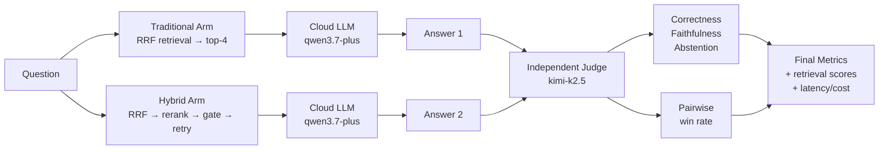

# Benchmarking & Evaluation Methodology

> **TL;DR**: Jev-RAG benchmarks two pipelines — **traditional** (embedding retrieval → cloud LLM) and **hybrid** (broad retrieval → local [Jev](glossary.md#jev)-style [System One](glossary.md#system-one) rerank/sufficiency/routing → cloud LLM → groundedness verification) — using metric definitions and judge protocols from **RAGAS**, **DeepEval**, **TruLens**, **MT-Bench** and **AbstentionBench**. A lightweight custom harness (`backend/app/bench/`) implements them without heavyweight framework dependencies. Everything except generation and judging runs locally on 2 CPU cores.

This document defines how Jev-RAG's two pipelines are benchmarked and compared. The methodology borrows metric definitions and judge protocols from the
de-facto standard RAG evaluation stack: **RAGAS** (0.4.3), **DeepEval (Confident AI)** (4.2.6),
**TruLens**, **MT-Bench** and **AbstentionBench**. A lightweight custom harness
(`backend/app/bench/`) implements them without heavyweight framework dependencies —
everything except generation and judging runs locally on 2 CPU cores.

## Evaluation Pipeline Overview



**How it works:** Each question is run through both pipelines in parallel. An independent judge (different model family) scores each answer for correctness, faithfulness, and abstention behavior, then compares the two answers pairwise. Retrieval metrics are computed deterministically (no LLM). The final report includes accuracy, calibration, efficiency, and statistical significance tests.

## Why a custom harness

RAGAS (0.4.3) and DeepEval (4.2.6) are pipeline-agnostic: you collect
`{question, retrieved_contexts, answer, reference}` per run and score both systems
identically. Both support any OpenAI-compatible endpoint. We borrow their **metric
definitions and judge protocols** but implement the loop directly because (a) the
hybrid pipeline's extra stages (rerank → top-4, sufficiency gate, model routing,
verification) need stage-level instrumentation the frameworks don't emit, and (b) the
harness must run inside the FastAPI process to survive the sandbox process reaper.

## Scenario taxonomy (6 corpora, 26 documents, 48 questions)

| Scenario | Category (lineage) | What it stresses |
|---|---|---|
| `techdocs` | Single-hop factoid QA (RAGAS "simple", wikiqa-style) | Baseline grounding over product docs |
| `finance` | Distractor-heavy numeric QA (FinanceBench-style) | Entity/quarter discrimination with near-identical numbers; multi-hop aggregation |
| `policy` | Conditional rule QA | Applying the right rule when near-matching rules and distractor conditions exist |
| `distractor` | Needle-in-haystack (NIAH/RULER-style) | Rerank precision under maximum lexical overlap (6 near-duplicate KB articles) |
| `multilingual` | Cross-lingual retrieval (MIRACL/MKQA-style) | Facts live in EN/ZH/DE/FR docs; questions asked in EN/ZH/DE |
| `outofscope` | Abstention (AbstentionBench-style) | 3 answerable + 5 unanswerable questions over one small corpus; sufficiency gate and refusal behaviour |

Corpora live in `backend/app/bench/corpora/<scenario>/*.md`; the question sets with
ground truth (reference answer, gold files, answerability, stress tags) live in
`backend/app/bench/scenarios.py`. Every run re-ingests its scenario documents through
the production ingestion path (markitdown → langchain splitters → fastembed → ChromaDB)
and isolates retrieval with a Chroma `doc_id` filter.

## Metrics

### 1. Deterministic retrieval metrics (no LLM)

Standard definitions (TREC / BeIR):

- **hit@k** — 1 if any of the top-k chunks is from a gold file. *(Did we find the right document in the top-k results?)*
- **MRR@10** ([Mean Reciprocal Rank](glossary.md#mrr10-mean-reciprocal-rank)) — mean reciprocal rank of the first gold chunk. *(On average, how early does the first correct result appear? 1.0 = always first.)*
- **recall@k** — distinct gold files found in top-k / total gold files (multi-hop coverage). *(Of all the documents we needed, what fraction did we retrieve?)*
- **nDCG@10** ([Normalized Discounted Cumulative Gain](glossary.md#ndcg10-normalized-discounted-cumulative-gain)) — DCG/IDCG with binary, file-level relevance; a gold file counts once at
  its first occurrence so duplicate chunks cannot inflate the score. *(Measures how well the top-10 results are ranked, where 1.0 is perfect. Penalizes relevant docs appearing late.)*

Both systems are scored on their **final context** (what the LLM actually saw) under a
**matched context budget**: traditional retrieves `top_k_use=4` directly (production
behaviour); hybrid retrieves `top_k_retrieve=10`, Jev-reranks, keeps `top_k_use=4`.

Hybrid-specific stage metrics:

- **Rerank lift** — final top-4 metrics minus naive embedding top-4 metrics (the
  counterfactual "what traditional would have gotten" from the same candidate pool). *(How much did reranking help? Positive = improvement over raw retrieval.)*
- **Gate accuracy / [Brier score](glossary.md#brier-score)** — the Jev sufficiency gate's `P(sufficient)` vs
  ground-truth answerability; Brier measures calibration
  (`mean((p − answerable)²)`). *(How well does the gate's confidence match reality? Lower Brier = better calibrated.)*

### 2. Generation metrics (LLM-as-judge, absolute scoring)

RAGAS-style definitions, judged per answer in a single structured JSON call:

- **Correctness (0–1)** — factual agreement with the reference answer (ground truth).
- **Faithfulness (0–1)** — fraction of the answer's claims supported by the retrieved
  context (RAGAS: supported claims / total claims).
- **Abstention (3-way)** — DeepEval AbstentionClassifier labels: `answered` /
  `abstained` (says information is missing) / `fabricated` (confident content not
  supported by context).

Derived behavioural metrics on the out-of-scope scenario:

- **Proper abstention rate** — abstains on unanswerable questions (higher is better).
- **Fabrication rate** — fabricates on unanswerable questions (lower is better).
- **Over-abstention rate** — abstains on answerable questions (lower is better).

### 3. Pairwise comparison (headline number)

MT-Bench protocol with position-swap: the judge sees both answers (with their own
contexts) and picks A / B / tie. **Both orders are judged**; inconsistent verdicts
resolve to tie, and a **position-consistency rate** is reported as the bias audit.
Win rate counts ties as 0.5. *(Which pipeline produces better answers overall? Position-swapping removes order bias.)*

### 4. Efficiency metrics

Per-question latency with per-stage breakdown (retrieval / Jev rerank /
sufficiency+routing / LLM / verification — judge time excluded), p50/p95, tokens,
and USD cost of cloud generation. *(How fast and how expensive is each pipeline? p50 = typical case, p95 = worst-case.)*

## Judge design & fairness protocol

- **Independent judge family**: the judge is `kimi-k2.5` on the same Dashscope
  endpoint — *different from both pipelines' generators* (qwen3.7-plus /
  qwen3.6-plus). This avoids the self-preference bias documented for LLM judges
  (MT-Bench, G-Eval). The RAG arms are unchanged: all generation still uses the two
  Qwen models the system is configured with. Judge choice is configurable via
  `JEVRAG_BENCH_JUDGE_MODEL`. *(Using a different model family for judging prevents the judge from favoring its own style.)*
- **temperature = 0, structured JSON only** (`response_format=json_object`), with a
  short human-readable `reason` for auditability and clamping/normalisation on parse.
- **Judge self-test**: every run starts with 8 canary cases with known expected
  outcomes (perfect answer, wrong number, refusal-on-answerable, fabrication, proper
  abstention, partial, correct-with-unsupported-extra, wrong entity). The agreement
  score is stored on the run — a cheap RAGAS-style judge-alignment guard.
- **Same questions, same corpus snapshot, same chunking, same prompts and knobs** for
  both arms — the hybrid arm mirrors `app/rag/pipelines.py` exactly (same system
  prompts, `SUFFICIENCY_THRESHOLD`, truncation limits), instrumented for pre/post
  rerank ranks.

## Statistical significance

> **Note**: With n=48 questions, pairwise win-rate has wide confidence intervals. Read it as indicative; lean on the per-metric absolutes and per-scenario breakdowns.

We report multiple statistical tests to quantify uncertainty honestly:

- **[McNemar's test](glossary.md#mcnemars-test)** (exact binomial on discordant pairs) — for binary outcomes (correct/incorrect). Tests whether the two pipelines differ significantly on the same questions.
- **[Wilcoxon signed-rank test](glossary.md#wilcoxon-signed-rank-test)** — for graded outcomes (e.g., correctness scores 0–1). Non-parametric paired test with rank-biserial effect size.
- **[Paired bootstrap CI](glossary.md#bootstrap-confidence-interval)** (50k samples, seed 42) — estimates the uncertainty of a metric delta. Reported as 95% CI; if it includes 0, the difference is not statistically significant.

Known limitations (documented, by design of scope): single judge model (no human
panel); one run per condition (no repetition/CI bands yet); pairwise win-rate on 48
questions has wide confidence intervals — read it as indicative, lean on the
per-metric absolutes and per-scenario breakdowns.

## Running a benchmark

From the UI: switch to the **Benchmarks** view, pick scenarios, press
*Run benchmark* — progress streams live and the dashboard aggregates client-side
while the run is in flight. Via API:

```bash
curl -X POST localhost:8000/api/bench/runs -H 'Content-Type: application/json' \
  -d '{"scenario_ids":["techdocs","finance","policy","distractor","multilingual","outofscope"]}'
curl localhost:8000/api/bench/runs/<id>     # run + results + summary
```

The runner executes sequentially inside the FastAPI process (the Jev engine is a
single subprocess; runs are serialised; only one active run is allowed). A full
6-scenario run is 48 questions × 2 systems ≈ 96 generations + ~240 judge calls
(48×2 absolute + 48×2 pairwise) ≈ 40–70 minutes on 2 CPU cores, a few cents of
endpoint spend.

Environment knobs: `JEVRAG_BENCH_JUDGE_MODEL` (default `kimi-k2.5`),
`JEVRAG_BENCH_PAIRWISE` (default on), `JEVRAG_BENCH_MAX_QUESTIONS_PER_SCENARIO`
(0 = all; useful for smoke runs).

## Resilience

The local jev-score subprocess can be OOM-killed by the sandbox under memory
pressure. `JevEngine` auto-reloads it (fresh subprocess) and retries the call once;
if the engine cannot come back up, a benchmark run **fails fast** with a clear error
instead of filling itself with per-question failures.

## Results snapshot

Completed runs are stored in SQLite (`bench_runs` / `bench_results`) and the headline
numbers are exported to `docs/benchmark-results.md` by
`backend/scripts/export_bench_results.py` after each full run.
