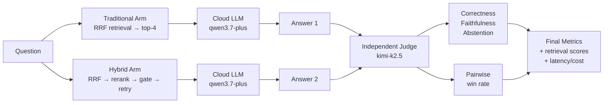

# Benchmarking & Evaluation Methodology

> **TL;DR**: Jev-RAG benchmarks two pipelines — **traditional** (embedding retrieval → cloud LLM) and **hybrid** (broad retrieval → local [Jev](glossary.md)-style [System One](glossary.md) rerank/sufficiency/routing → cloud LLM → groundedness verification) — using metric definitions and judge protocols from **RAGAS**, **DeepEval**, **TruLens**, **MT-Bench** and **AbstentionBench**. A lightweight custom harness (`backend/app/bench/`) implements them without heavyweight framework dependencies. Everything except generation and judging runs locally on CPU.

This document defines how Jev-RAG's two pipelines are benchmarked and compared. The methodology borrows metric definitions and judge protocols from the
de-facto standard RAG evaluation stack: **RAGAS** (0.4.3), **DeepEval (Confident AI)** (4.2.6),
**TruLens**, **MT-Bench** and **AbstentionBench**. A lightweight custom harness
(`backend/app/bench/`) implements them without heavyweight framework dependencies —
everything except generation and judging runs locally on CPU.

## Evaluation Pipeline Overview



**How it works:** Each question is run through both pipelines in parallel. An independent judge (different model family) scores each answer for correctness, faithfulness, and abstention behavior, then compares the two answers pairwise. Retrieval metrics are computed deterministically (no LLM). The final report includes accuracy, calibration, efficiency, and statistical significance tests.

## Why a custom harness

RAGAS (0.4.3) and DeepEval (4.2.6) are pipeline-agnostic: you collect
`{question, retrieved_contexts, answer, reference}` per run and score both systems
identically. Both support any OpenAI-compatible endpoint. We borrow their **metric
definitions and judge protocols** but implement the loop directly because (a) the
hybrid pipeline's extra stages (rerank → top-4, sufficiency gate, model routing,
verification) need stage-level instrumentation the frameworks don't emit, and (b) the
harness must run inside the FastAPI process to survive the sandbox process reaper.

## Scenario taxonomy (6 internal corpora, 26 documents, 48 questions + 5 public benchmarks, 98 questions)

| Scenario | Category (lineage) | What it stresses |
|---|---|---|
| `techdocs` | Single-hop factoid QA (RAGAS "simple", wikiqa-style) | Baseline grounding over product docs |
| `finance` | Distractor-heavy numeric QA (FinanceBench-style) | Entity/quarter discrimination with near-identical numbers; multi-hop aggregation |
| `policy` | Conditional rule QA | Applying the right rule when near-matching rules and distractor conditions exist |
| `distractor` | Needle-in-haystack (NIAH/RULER-style) | Rerank precision under maximum lexical overlap (6 near-duplicate KB articles) |
| `multilingual` | Cross-lingual retrieval (MIRACL/MKQA-style) | Facts live in EN/ZH/DE/FR docs; questions asked in EN/ZH/DE |
| `outofscope` | Abstention (AbstentionBench-style) | 3 answerable + 5 unanswerable questions over one small corpus; sufficiency gate and refusal behaviour |
| `squad` / `triviaqa` | Public single-hop (Rajpurkar et al. 2016; Joshi et al. 2017) | 25 + 16 answerable questions over Wikipedia articles (1 question per article) |
| `hotpotqa` / `wiki2` / `musique` | Public multi-hop (Yang et al. 2018; Ho et al. 2020; Trivedi et al. 2022) | 25 + 16 + 16 answerable multi-hop questions; all gold files required for coverage |

The internal suite is the abstention/control layer (it holds all 5 unanswerable questions);
the public suite is the current Layer-2 measurement layer (all 98 answerable). Counts trace
to `backend/app/bench/corpora/public_benchmarks.json` (dataset URLs + sampling seeds in its
`provenance` block; builder `backend/scripts/build_public_scenarios.py`). Gate
calibration tables therefore use a retrieval-coverage basis (first gate reading vs
gold-in-final-top4), not answerability — see the gate contract in `backend/AGENTS.md`.

Corpora live in `backend/app/bench/corpora/<scenario>/*.md`; the question sets with
ground truth (reference answer, gold files, answerability, stress tags) live in
`backend/app/bench/scenarios.py`. Every run re-ingests its scenario documents through
the production ingestion path (markitdown → langchain splitters → fastembed → ChromaDB)
and isolates retrieval with a Chroma `doc_id` filter.

## Metrics

### 1. Deterministic retrieval metrics (no LLM)

Standard definitions (TREC / BeIR):

- **hit@k** — 1 if any of the top-k chunks is from a gold file. *(Did we find the right document in the top-k results?)*
- **MRR@10** ([Mean Reciprocal Rank](glossary.md)) — mean reciprocal rank of the first gold chunk. *(On average, how early does the first correct result appear? 1.0 = always first.)*
- **recall@k** — distinct gold files found in top-k / total gold files (multi-hop coverage). *(Of all the documents we needed, what fraction did we retrieve?)*
- **nDCG@10** ([Normalized Discounted Cumulative Gain](glossary.md)) — DCG/IDCG with binary, file-level relevance; a gold file counts once at
  its first occurrence so duplicate chunks cannot inflate the score. *(Measures how well the top-10 results are ranked, where 1.0 is perfect. Penalizes relevant docs appearing late.)*

Both systems are scored on their **final context** (what the LLM actually saw) under a
**matched context budget**: traditional retrieves `top_k_use=4` directly (production
behaviour); hybrid retrieves `top_k_retrieve=10`, Jev-reranks, keeps `top_k_use=4`.

Hybrid-specific stage metrics:

- **Rerank lift** — final top-4 metrics minus naive embedding top-4 metrics (the
  counterfactual "what traditional would have gotten" from the same candidate pool). *(How much did reranking help? Positive = improvement over raw retrieval.)*
- **Gate accuracy / [Brier score](glossary.md)** — the Jev sufficiency gate's `P(sufficient)` vs
  ground-truth answerability; Brier measures calibration
  (`mean((p − answerable)²)`). *(How well does the gate's confidence match reality? Lower Brier = better calibrated.)*

### 2. Generation metrics (LLM-as-judge, absolute scoring)

RAGAS-style definitions, judged per answer in a single structured JSON call:

- **Correctness (0–1)** — factual agreement with the reference answer (ground truth).
- **Faithfulness (0–1)** — fraction of the answer's claims supported by the retrieved
  context (RAGAS: supported claims / total claims).
- **Abstention (3-way)** — DeepEval AbstentionClassifier labels: `answered` /
  `abstained` (says information is missing) / `fabricated` (confident content not
  supported by context).

Derived behavioural metrics on the out-of-scope scenario:

- **Proper abstention rate** — abstains on unanswerable questions (higher is better).
- **Fabrication rate** — fabricates on unanswerable questions (lower is better).
- **Over-abstention rate** — abstains on answerable questions (lower is better).

### 3. Pairwise comparison (headline number)

MT-Bench protocol with position-swap: the judge sees both answers (with their own
contexts) and picks A / B / tie. **Both orders are judged**; inconsistent verdicts
resolve to tie, and a **position-consistency rate** is reported as the bias audit.
Win rate counts ties as 0.5. *(Which pipeline produces better answers overall? Position-swapping removes order bias.)*

### 4. Efficiency metrics

Per-question latency with per-stage breakdown (retrieval / Jev rerank /
sufficiency+routing / LLM / verification — judge time excluded), p50/p95, tokens,
and USD cost of cloud generation. *(How fast and how expensive is each pipeline? p50 = typical case, p95 = worst-case.)*
Row tokens/costs include System-Two helper calls (decompose, rewrite, best-of-2
candidates) folded in from decision usages (`app/rag/pipelines.py:sum_token_usage`) —
the final-generation usage alone systematically understates the hard path. Judge tokens
are excluded by design: judging is measurement overhead, not pipeline cost, so
per-suite totals understate the full cloud bill by the judge's share.

### 5. Context precision & recall (RAGAS-style LLM-based retrieval diagnostics)

These metrics diagnose **WHERE** retrieval failures occur — ranking quality vs coverage gaps — using LLM judges to evaluate retrieval beyond deterministic file-level metrics.

- **Context precision** (0–1) — Are relevant chunks ranked highly? Computes average precision (AP) over ranked verdicts: for each retrieved chunk, the judge determines if it's useful for answering the question, then AP measures how early relevant chunks appear.
  - 1.0 = all relevant chunks at the top
  - 0.5 = relevant chunks scattered
  - 0.0 = no relevant chunks retrieved
  - *Diagnoses reranking quality*

- **Context recall** (0–1) — Was all needed context retrieved? Decomposes the reference answer into atomic claims, then checks how many are supported by the retrieved context.
  - 1.0 = all claims supported by context
  - 0.5 = half the claims supported
  - 0.0 = no claims supported
  - *Diagnoses retrieval coverage gaps*

**Implementation:** `backend/app/bench/metrics.py:context_precision()` and `context_recall()` follow RAGAS 0.4.3 definitions. Precision judges **each chunk separately** (per-chunk texts from the bench done-event `context_chunks`, in rank order) — passing one concatenated block would make the average-precision computation degenerate (a single binary verdict). Each metric adds ~2 LLM calls per question (one per chunk for precision; one decomposition + one per claim for recall).

**Configuration:** `JEVRAG_BENCH_CONTEXT_METRICS` (bool, default `true`). Disable to save LLM calls when only deterministic retrieval metrics are needed.

**Reference:** [RAGAS context metrics](https://docs.ragas.io/en/stable/concepts/metrics/available_metrics/)

## Judge design & fairness protocol

- **Independent judge family**: the judge is `kimi-k2.5` on the same Dashscope
  endpoint — *different from both pipelines' generators* (qwen3.7-plus /
  qwen3.6-plus). This avoids the self-preference bias documented for LLM judges
  (MT-Bench, G-Eval). The RAG arms are unchanged: all generation still uses the two
  Qwen models the system is configured with. Judge choice is configurable via
  `JEVRAG_BENCH_JUDGE_MODEL`. *(Using a different model family for judging prevents the judge from favoring its own style.)*

- **Multi-judge ensemble** (optional): `MultiJudgeEnsemble` in `backend/app/bench/judge.py` aggregates scores across multiple independent judges to reduce variance and detect judge bias.
  - **Configuration:** `JEVRAG_BENCH_JUDGE_ENSEMBLE` (str, comma-separated model names, empty = single judge). Example: `"kimi-k2.5,gpt-4o-mini,claude-3-haiku"`
  - **Aggregation:** mean for continuous scores (correctness, faithfulness), majority vote for categorical decisions (abstention, pairwise winner)
  - **Agreement metrics:** Reports inter-judge agreement (1 − CV for continuous scores, vote fraction for categorical)
  - **Reference:** OpenJury framework, Cohere research on multi-judge reliability
- **temperature = 0, structured JSON only** (`response_format=json_object`), with a
  short human-readable `reason` for auditability and clamping/normalisation on parse.
- **Prompt rules that matter:** a proper abstention on an unanswerable question scores
  correctness 1.0 (refusing IS the correct response there — pinned by self-test canary 9);
  references may list acceptable aliases separated by ` / ` (the public-benchmark builder
  joins them that way). Prompt changes move the judge: runs before/after 2026-10-03 are
  not directly comparable on abstention-heavy suites.
- **Judge self-test**: every run starts with 9 canary cases with known expected
  outcomes (perfect answer, wrong number, refusal-on-answerable, fabrication, proper
  abstention, partial, correct-with-unsupported-extra, wrong entity, proper-abstention
  correctness). The agreement score is stored on the run — a cheap RAGAS-style
  judge-alignment guard.
- **Pairwise outage semantics:** when either position-swapped call fails, the verdict is
  `error` with `judge_error: true` — aggregators exclude these rows from win-rate
  denominators, never count them as ties.
- **Same questions, same corpus snapshot, same chunking, same prompts and knobs** for
  both arms — the hybrid arm mirrors `app/rag/pipelines.py` exactly (same system
  prompts, gate thresholds, truncation limits), instrumented for pre/post
  rerank ranks.

## Statistical significance

> **Note**: With n=48 questions, pairwise win-rate has wide confidence intervals. Read it as indicative; lean on the per-metric absolutes and per-scenario breakdowns.

We report multiple statistical tests to quantify uncertainty honestly:

- **[McNemar's test](glossary.md)** (exact binomial on discordant pairs) — for binary outcomes (correct/incorrect). Tests whether the two pipelines differ significantly on the same questions.
- **[Wilcoxon signed-rank test](glossary.md)** — for graded outcomes (e.g., correctness scores 0–1). Non-parametric paired test with rank-biserial effect size.
- **[Paired bootstrap CI](glossary.md)** (50k samples, seed 42) — estimates the uncertainty of a metric delta. Reported as 95% CI; if it includes 0, the difference is not statistically significant.

Known limitations (documented, by design of scope): single judge model (no human
panel); one run per condition (no repetition/CI bands yet); pairwise win-rate on 48
questions has wide confidence intervals — read it as indicative, lean on the
per-metric absolutes and per-scenario breakdowns.

## Running a benchmark

From the UI: switch to the **Benchmarks** view, pick scenarios, press
*Run benchmark* — progress streams live and the dashboard aggregates client-side
while the run is in flight. Via API:

```bash
curl -X POST localhost:8000/api/bench/runs -H 'Content-Type: application/json' \
  -d '{"scenario_ids":["techdocs","finance","policy","distractor","multilingual","outofscope"]}'
curl localhost:8000/api/bench/runs/<id>     # run + results + summary
```

The runner executes sequentially inside the FastAPI process (the Jev engine is a
single subprocess; runs are serialised; only one active run is allowed **per process**).
A full 6-scenario internal run is 48 questions × 2 systems ≈ 96 generations + ~240 judge
calls (48×2 absolute + 48×2 pairwise) — tens of minutes on local CPU, a few cents of
endpoint spend. The Layer-2 testbench (9 arms × 98 public questions = 882 triples) runs
under the parallel procedure below instead.

On a workstation, the same suite runs several times faster with **one worker process per
scenario on its own data directory** — that is an execution detail, not a methodology
change, and every metric, judge and arm definition above still binds. See
[parallel-bench-runbook.md](parallel-bench-runbook.md) for the launch/monitor/merge
procedure and the worker contracts.

Environment knobs: `JEVRAG_BENCH_JUDGE_MODEL` (default `kimi-k2.5`),
`JEVRAG_BENCH_PAIRWISE` (default on), `JEVRAG_BENCH_MAX_QUESTIONS_PER_SCENARIO`
(0 = all; useful for smoke runs), `JEVRAG_BENCH_CONTEXT_METRICS` (default on; RAGAS-style context precision/recall),
`JEVRAG_BENCH_JUDGE_ENSEMBLE` (comma-separated judge models, empty = single judge).

## Query robustness testing

Beyond static benchmark scores, real-world RAG systems must handle natural query variation. The `backend/scripts/test_query_robustness.py` script measures pipeline stability under paraphrasing — do we retrieve the same documents and produce the same answers when users ask the same question differently?

**What it measures:**
- **Retrieval stability** — fraction of paraphrases that retrieve the identical file set as the original query
- **File overlap (Jaccard)** — average set similarity between original and paraphrase retrievals
- **Answer consistency** — fraction of paraphrases producing the exact same answer (case-insensitive)
- **Latency variance** — how much does response time fluctuate across paraphrases?

**How it works:**
1. For each question in a scenario, generate N paraphrases using the LLM (preserving semantic meaning, varying structure/vocabulary)
2. Run the original query and all paraphrases through the pipeline
3. Compare retrieved file sets and generated answers
4. Report per-question and aggregate stability metrics

**Usage:**
```bash
# Test techdocs scenario with 4 paraphrases per question
python backend/scripts/test_query_robustness.py --scenario techdocs --n-paraphrases 4

# Test hybrid pipeline only, limit to 10 questions
python backend/scripts/test_query_robustness.py --scenario finance --mode hybrid --max-questions 10

# Save results to JSON
python backend/scripts/test_query_robustness.py --scenario techdocs --output robustness.json
```

**Configuration:** `JEVRAG_BENCH_ROBUSTNESS_PARAPHRASES` (int, default 0 = disabled). Set to 3-5 for robustness testing. Adds ~N LLM calls per question (paraphrase generation).

**Interpretation:**
- ≥90% retrieval stability + ≥90% answer consistency = excellent robustness
- 70-90% = good but some sensitivity to phrasing
- <70% = pipeline is highly sensitive to query variation; consider query expansion or retrieval improvements

**Reference:** "How You Ask Matters" (arXiv 2604.10745) found 55% decision flips on human rewrites; "Out of Style" (EACL 2026) found 40% Recall@5 drop on informal queries.

## Statistical power analysis

Most RAG benchmarks are underpowered — they run on 48-100 questions and claim significance without checking if the sample size is sufficient to detect meaningful differences. The `backend/scripts/power_analysis.py` script computes the **minimum detectable effect (MDE)** for paired benchmark comparisons using statsmodels.

**What it computes:**
- **MDE (Cohen's d)** — the smallest effect size the benchmark can reliably detect given n questions, correlation ρ, α=0.05, power=0.80
  - Small effect: d ≈ 0.2
  - Medium effect: d ≈ 0.5
  - Large effect: d ≈ 0.8
- **Required sample size** — how many questions needed to detect a given effect size
- **Correlation estimation** — Pearson correlation between the two systems' outcomes (higher correlation → higher power for paired tests)

**How it works:**
1. Extract paired outcomes (traditional vs hybrid correctness) from a benchmark run
2. Estimate correlation ρ between the two systems
3. Compute MDE using paired t-test formula: MDE_paired = MDE_independent × √(1-ρ)
4. Report required n for small/medium/large effects

**Usage:**
```bash
# Analyze an existing benchmark run
python backend/scripts/power_analysis.py --run-id <run_id>

# Manual calculation: can we detect a 5% improvement (p1=0.875, p2=0.927) with n=48?
python backend/scripts/power_analysis.py --p1 0.875 --p2 0.927 --n 48 --rho 0.5

# Save results to JSON
python backend/scripts/power_analysis.py --run-id <run_id> --output power.json
```

**Interpreting MDE:**
- MDE ≥ 0.8 (large): ⚠️ Underpowered — can only detect large effects. Most RAG improvements are small-medium (d=0.2-0.5).
- MDE 0.5-0.8 (medium): ⚠️ Moderate power — can detect medium-large effects, but small effects may be missed.
- MDE < 0.5 (small-medium): ✅ Well-powered — can detect meaningful RAG improvements.

**Key insight:** For paired tests, higher correlation ρ between systems increases power (reduces MDE). If traditional and hybrid agree on 80% of questions (ρ=0.8), the effective sample size is n × (1-ρ) = n × 0.2, but the paired test variance is (1-ρ) × var_independent, so MDE_paired = MDE_independent × √(0.2) ≈ 0.45 × MDE_independent.

**Reference:** clawRxiv 2604.01974: Power Analysis for Pairwise Model Comparisons; statsmodels documentation.

## Resilience

The local jev-score subprocess can be OOM-killed by the sandbox under memory
pressure. `JevEngine` auto-reloads it (fresh subprocess) and retries the call once;
if the engine cannot come back up, a benchmark run **fails fast** with a clear error
instead of filling itself with per-question failures.

## Results snapshot

Completed runs are stored in SQLite (`bench_runs` / `bench_results`) and the headline
numbers are exported to `docs/benchmark-results.md` by
`backend/scripts/export_bench_results.py` after each full run.
